# Application Features and Specifications

## Technical Specification: /Users/domicianorincon/Documents/GIT/Compunet2-252/classnotesapp/src/main.jsx

### 1. Overview
This file serves as the entry point of the React application, responsible for rendering the entire app to the DOM.

Type: Entry Point (main application component)

### 2. Functionality & Responsibilities
The main.jsx file sets up the basic structure and theme of the application. It renders the App component within a BrowserRouter, which enables client-side routing using react-router-dom. The App component is wrapped in ThemeProvider and StudiedLessonsProvider to manage global state.

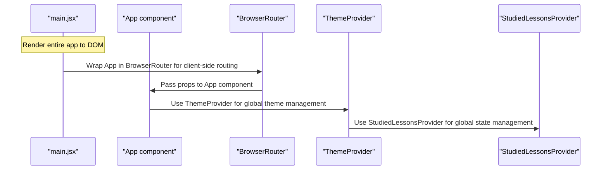

### 3. Inputs (Props/Parameters)
None, as this is the entry point of the application.

### 4. Outputs/Side Effects
- Renders the entire app to the DOM.
- Sets up client-side routing using BrowserRouter.
- Manages global theme and state through ThemeProvider and StudiedLessonsProvider.

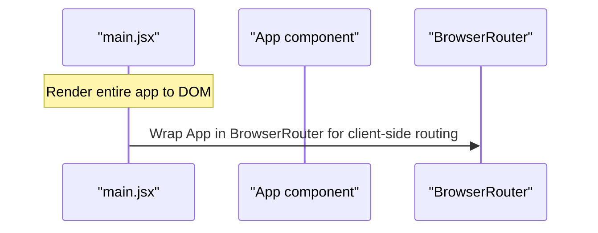

### 5. Internal Dependencies
- `./App`: The main application component.
- `./index.css`: Global CSS styles for the application.
- `./theme/ThemeContext` and `./theme/StudiedLessonsContext`: Context providers for global theme and state management.

### 6. External Dependencies
- `react-dom/client`: For rendering the React app to the DOM.
- `react-router-dom`: For client-side routing.
- `prismjs/themes/prism-tomorrow.css`: CSS styles for code highlighting.

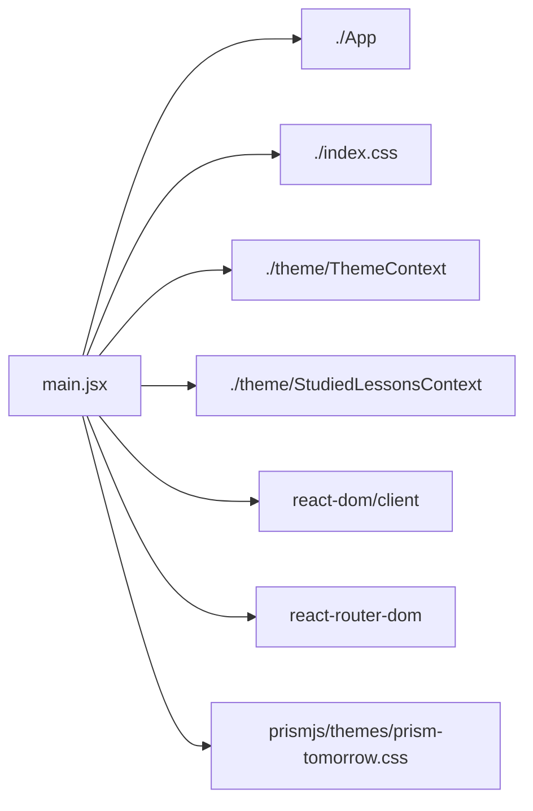

### 7. Usage Examples
This file is not typically used directly by other parts of the application, as it serves as the entry point.

### 8. Notes/Considerations
- This file should be kept simple and focused on setting up the basic structure of the app.
- Any complex logic or business rules should be handled within the App component or other relevant components.


Note: The Mermaid diagrams provided are simplified representations of the functionality. They do not include all possible interactions and dependencies but aim to give a general idea of how the main.jsx file works.

## Technical Specification: /Users/domicianorincon/Documents/GIT/Compunet2-252/classnotesapp/src/App.jsx

### 1. Overview
This file defines the main application component (`App`) of a React-based learning platform, responsible for rendering the course content and handling user navigation.

### 2. Functionality & Responsibilities
The `App` component:

* Loads and parses the table of contents (TOC) from a Markdown file (`toc.md`) using the `TableOfContentsParser` utility.
* Stores the parsed sections in state (`sections`) and indicates loading status (`loading`).
* Handles user navigation by redirecting to specific lesson pages based on the current URL path or deep linking parameters.
* Renders an app bar with global navigation and a layout component containing the course content.

### 3. Inputs (Props/Parameters)
None, as this is a top-level React component.

### 4. Outputs/Side Effects
The `App` component returns JSX elements for rendering the application UI. It also performs the following side effects:

* Makes an API call to parse the TOC using `TableOfContentsParser`.
* Mutates local state (`sections`, `loading`) based on the parsed TOC and user navigation.
* Emits events for opening mobile navigation and TOC.

### 5. Internal Dependencies
The file imports the following internal modules:

* `Layout` component: renders the course content layout with navigation.
* `AppBarGlobal` component: provides a global app bar with navigation links.
* `LessonPage` component: renders individual lesson pages.
* `TableOfContentsParser` utility: parses TOC from Markdown files.

### 6. External Dependencies
The file imports the following external libraries:

* `react-router-dom`: for client-side routing and navigation management.
* `react`: for building the React application.

### 7. Usage Examples (Optional)
```jsx
import App from './App';

function CourseContainer() {
  return (
    <div>
      <App />
    </div>
  );
}
```
This example demonstrates how to render the `App` component within a container component (`CourseContainer`).

### 8. Notes/Considerations

* The application uses client-side routing with React Router, allowing for deep linking and seamless navigation.
* The TOC parsing utility is designed to handle Markdown files with specific formatting requirements.

### 9. Mermaid Diagram
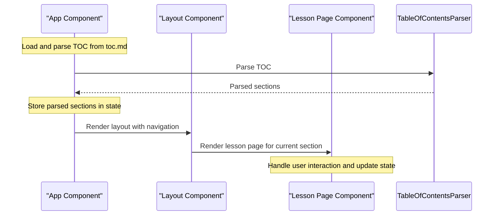
This Mermaid diagram illustrates the sequence of events when loading and rendering the course content, including TOC parsing, state updates, and component interactions.

## Technical Specification: /Users/domicianorincon/Documents/GIT/Compunet2-252/classnotesapp/src/prism/languages/prism-sql-enhanced.js

### 1. Overview
This file is a part of the Prism library, which is used for syntax highlighting in code editors. The `prism-sql-enhanced.js` file specifically enhances the SQL language support by adding custom patterns and rules for better highlighting.

Type: Utility Function (part of the Prism library)

### 2. Functionality & Responsibilities
This file defines a set of regular expressions to match various elements in SQL syntax, such as comments, strings, keywords, functions, booleans, numbers, operators, and punctuation. These patterns are used by the Prism library to highlight SQL code.

The main responsibility of this file is to provide accurate highlighting for SQL code, making it easier for developers to read and understand their database queries.

### 3. Inputs (Props/Parameters)
None

### 4. Outputs/Side Effects
This file does not return any values or produce side effects. It simply defines the regular expressions used by the Prism library for syntax highlighting.

### 5. Internal Dependencies
- `prism.js`: The main Prism library file, which is imported to use its functionality.
- `languages/prism-sql.js`: Another SQL language definition file that is extended in this file.

These dependencies are necessary because they provide the foundation for the Prism library and the specific language definitions used by this file.

### 6. External Dependencies
None

### 7. Usage Examples (Optional)
```javascript
const sqlCode = `
SELECT * FROM users WHERE id = 1;
`;

const highlightedCode = Prism.highlight(sqlCode, Prism.languages.sql);
console.log(highlightedCode);
```
This example shows how to use the `Prism.highlight()` function with the SQL language definition defined in this file.

### 8. Notes/Considerations
- This file is a part of the larger Prism library and should be maintained accordingly.
- The regular expressions used in this file are specific to SQL syntax and may need adjustments for other database query languages.

### 9. Mermaid Diagram

```mermaid
graph LR;
    A[Prism Library] --> B[Language Definitions];
    C[prism-sql-enhanced.js] --> D[SQL Language Definition];
    E[Prism.highlight()] --> F[Highlighted Code];
```
This diagram shows the flow from the Prism library to the language definitions, including this file's contribution. The highlighted code is then produced by calling `Prism.highlight()` with the SQL language definition.

## Technical Specification: /Users/domicianorincon/Documents/GIT/Compunet2-252/classnotesapp/src/prism/languages/prism-java-enhanced.js

### 1. Overview
This file is responsible for defining the syntax highlighting rules for Java code within the application. It's a part of the Prism library, which is used to highlight and format source code in various programming languages.

### 2. Functionality & Responsibilities
The primary purpose of this file is to define how Java code should be highlighted and formatted. This includes identifying keywords, comments, strings, numbers, operators, and other syntax elements specific to the Java language.

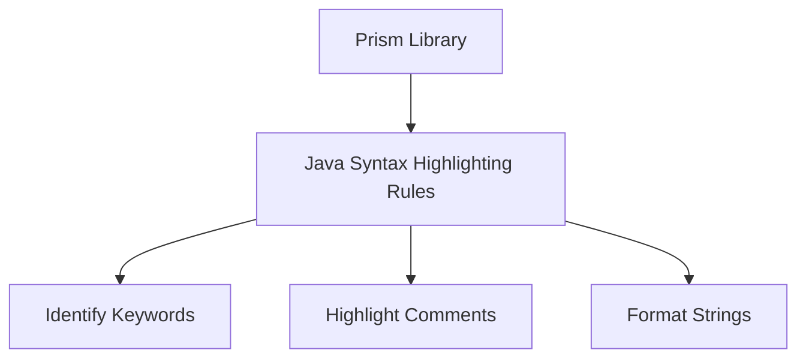

### 3. Inputs (Props/Parameters)
This file does not accept any props or parameters.

### 4. Outputs/Side Effects
The output of this file is a set of syntax highlighting rules that will be applied to Java code within the application. There are no side effects, as it only defines how code should be formatted and highlighted.

### 5. Internal Dependencies
This file imports other Prism language definitions, which are used to extend or modify the existing syntax highlighting rules.

```javascript
import 'prism-languages';
```

### 6. External Dependencies
The only external dependency is the Prism library itself, which provides the core functionality for syntax highlighting and formatting.

```javascript
import Prism from 'prismjs';
```

### 7. Usage Examples (Optional)
This file is not typically used directly by other parts of the application. Instead, it's included as part of the Prism library to provide Java syntax highlighting capabilities.

```javascript
// Example usage:
const code = `
public class HelloWorld {
    public static void main(String[] args) {
        System.out.println("Hello, World!");
    }
}
`;

Prism.highlight(code, Prism.languages.java);
```

### 8. Notes/Considerations
This file is a part of the Prism library and should be maintained in sync with the latest version of Prism.

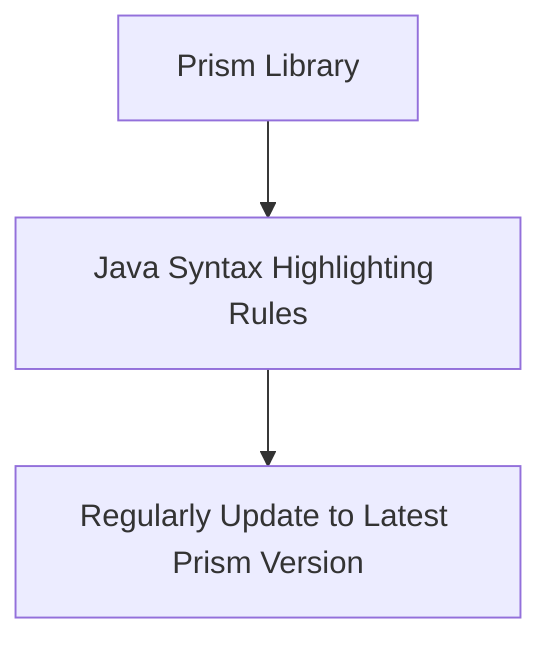

### 9. Mermaid Diagram


## Technical Specification: /Users/domicianorincon/Documents/GIT/Compunet2-252/classnotesapp/src/prism/languages/prism-http.js

### 1. Overview
This file is a custom language definition for Prism.js, a popular code highlighting library. It defines the syntax and highlighting rules for HTTP requests in various programming languages.

Type: Custom Language Definition for Prism.js

### 2. Functionality & Responsibilities
This file solves the problem of providing accurate syntax highlighting for HTTP requests within code editors that use Prism.js. It implements specific patterns to match HTTP methods, URLs, headers, status codes, and other relevant elements in HTTP requests.

The file defines a set of regular expressions (patterns) to identify these elements within the code. These patterns are then used by Prism.js to apply highlighting rules accordingly.

### 3. Inputs (Props/Parameters)
None. This is not a React component or function that accepts parameters.

### 4. Outputs/Side Effects
This file does not return any data or produce side effects like API calls, state mutations, or DOM manipulations. Its purpose is to define the syntax highlighting rules for HTTP requests within Prism.js.

### 5. Internal Dependencies
- `Prism`: The main Prism.js library that this custom language definition will extend.

### 6. External Dependencies
None. This file does not import any external libraries or packages other than the Prism.js library, which is a dependency of the project.

### 7. Usage Examples (Optional)
To use this custom language definition within your application, you would typically include it in your Prism.js configuration. Here's an example:

```javascript
Prism.highlight('GET /users HTTP/1.1\nHost: example.com', Prism.languages.http);
```

This code snippet highlights the provided HTTP request using the rules defined in `prism-http.js`.

### 8. Notes/Considerations
- This file is a custom extension for Prism.js and does not have any specific performance considerations or known limitations.
- Future improvements could involve adding support for more advanced HTTP features, such as WebSockets or HTTP/2.

### 9. Mermaid Diagram

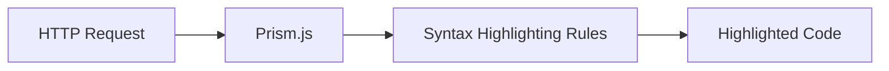

This diagram illustrates the flow from an HTTP request to its highlighting within Prism.js, using the rules defined in `prism-http.js`.

## Technical Specification: /Users/domicianorincon/Documents/GIT/Compunet2-252/classnotesapp/src/utils/markdownUtils.js

### 1. Overview
This file contains a utility function named `getFirstTitleFromMarkdown` that extracts the first title from a given Markdown content.

Type: Utility Function

### 2. Functionality & Responsibilities
The primary purpose of this function is to parse Markdown content and extract the first title, which starts with `[t]`. It iterates through each line in the Markdown content, trims any leading or trailing whitespace, and checks if the line starts with `[t]`. If a title is found, it returns the trimmed title; otherwise, it returns `null`.

### 3. Inputs (Props/Parameters)
- **markdownContent**: The complete Markdown content as a string.

### 4. Outputs/Side Effects
This function returns either the first title extracted from the Markdown content or `null` if no title is found.

### 5. Internal Dependencies
None

### 6. External Dependencies
None

### 7. Usage Examples (Optional)
```javascript
const markdownContent = `
[t] Primer título
Contenido del primer título.
[t] Segundo título
Contenido del segundo título.
`;

const firstTitle = getFirstTitleFromMarkdown(markdownContent);
console.log(firstTitle); // Output: "Primer título"
```

### 8. Notes/Considerations
This function assumes that the Markdown content is well-formed and that titles are correctly marked with `[t]`. It does not handle cases where there might be multiple titles or when a title is missing its `[t]` marker.

### 9. Mermaid Diagram

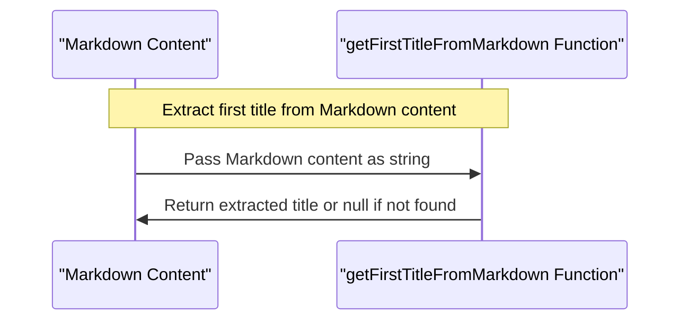

This specification details the functionality and behavior of `markdownUtils.js`, including its purpose, inputs, outputs, dependencies, and usage examples. The Mermaid diagram visually represents the sequence of operations performed by the function to extract the first title from Markdown content.

## Technical Specification: /Users/domicianorincon/Documents/GIT/Compunet2-252/classnotesapp/src/utils/tableOfContentsParser.js

### 1. Overview
This file, `tableOfContentsParser.js`, is a utility function that parses the table of contents (TOC) content from Markdown files and returns a structured array of sections. It's responsible for extracting relevant information such as titles, lesson labels, and file paths.

Type: Utility Function

### 2. Functionality & Responsibilities
The `TableOfContentsParser` function takes in TOC content as a string, splits it into lines, and iterates over each line to identify different types of sections (titles, dividers, lessons). It extracts relevant information from each section and constructs an array of objects representing the parsed table of contents.

### 3. Inputs (Props/Parameters)
- `tocContent`: The TOC content as a string

### 4. Outputs/Side Effects
The function returns an array of objects representing the parsed table of contents, where each object has properties for section type (`type`), ID (`id`), label (`label`), and file path (`filePath`). There are no side effects.

### 5. Internal Dependencies
- `./markdownUtils`: Provides the `getFirstTitleFromMarkdown` function to extract the first title from a Markdown file.
- `./lessonImporter`: Exports an object containing raw lesson contents, where each key is a file path and the value is the corresponding content.

### 6. External Dependencies
None

### 7. Usage Examples (Optional)
```javascript
import TableOfContentsParser from './tableOfContentsParser';

const tocContent = '[t] Introduction\n[d]\n[lesson] lesson1.md\n[t] Lesson 1 Title';
const parsedToc = await TableOfContentsParser(tocContent);
console.log(parsedToc); // Output: [{ type: 'title', id: 'introduction', label: 'Introduction' }, { type: 'divider' }, { type: 'lesson', id: '1', label: 'Lesson 1 Title', filePath: 'lesson1.md' }]
```

### 8. Notes/Considerations
- This utility function assumes that the TOC content is well-formatted and follows a specific structure.
- It's essential to ensure that the `./lessonImporter` object contains the correct raw lesson contents for each file path.

### 9. Mermaid Diagram

```mermaid
graph TD;
    A[TOC Content] -->|split into lines|> B[List of Lines];
    B -->|iterate over lines|> C[Section Type Identification];
    C -->|title section|> D[TITLE Section Object];
    C -->|divider section|> E[DIVIDER Section Object];
    C -->|lesson section|> F[LESSON Section Object];
    F -->|extract lesson label and file path|> G[LESSON Section Object with Label and FilePath];
```

This Mermaid diagram illustrates the flow of processing TOC content, identifying different types of sections, and constructing objects for each type.

## Technical Specification: /Users/domicianorincon/Documents/GIT/Compunet2-252/classnotesapp/src/utils/lessonImporter.js

### 1. Overview
This file serves as a utility function, responsible for importing and processing lesson content from Markdown files located in the `/content` directory.

### 2. Functionality & Responsibilities
The `lessonImporter.js` file imports all Markdown files within the specified directory using the `import.meta.glob()` method. It then processes these files by extracting their raw contents and storing them in an object called `lessonRawContents`. This object is then exported as the default export of this module.

### 3. Inputs (Props/Parameters)
None, as this file does not accept any props or parameters.

### 4. Outputs/Side Effects
The file exports an object (`lessonRawContents`) containing the raw contents of all Markdown files in the `/content` directory.

### 5. Internal Dependencies
- `import.meta.glob()`: A built-in Webpack function used for dynamic imports.
- `@/content/*.md`: A glob pattern specifying the directory and file extension to import from.

### 6. External Dependencies
None, as this file relies solely on built-in functionality and does not import any external libraries or packages.

### 7. Usage Examples (Optional)
```javascript
import lessonRawContents from './lessonImporter';

console.log(lessonRawContents); // Output: An object containing the raw contents of all Markdown files.
```

### 8. Notes/Considerations
- This utility function assumes that the Markdown files in the `/content` directory are correctly formatted and contain valid content.
- The `eager` option is set to `true`, which means that all imports will be executed immediately, rather than lazily.

### 9. Mermaid Diagram (Sequence)
```mermaid
sequence
    Participant Importer as I
    Participant LessonContent as LC

    I->>LC: Import Markdown files from /content directory
    LC->>I: Process and extract raw contents of each file
    I->>I: Store extracted contents in lessonRawContents object
    I->>I: Export lessonRawContents object as default export
```
This diagram illustrates the sequence of events performed by the `lessonImporter.js` file, from importing Markdown files to processing their contents and exporting the resulting object.

## Technical Specification: /Users/domicianorincon/Documents/GIT/Compunet2-252/classnotesapp/src/components/AppBarGlobal.jsx

### 1. Overview
The `AppBarGlobal` component is a React component responsible for rendering the global application bar, which includes features such as theme switching, navigation menu, and logo display.

### 2. Functionality & Responsibilities
This file implements the following features:

*   Theme switching: allows users to toggle between light and dark modes.
*   Navigation menu: provides access to the table of contents on mobile devices.
*   Logo display: shows the application's logo with a link to its homepage.
*   Responsive design: adapts the layout and content based on screen size.

### 3. Inputs (Props/Parameters)
The `AppBarGlobal` component expects two props:

*   `onOpenMobileToc`: a function that handles opening the table of contents on mobile devices.
*   `onOpenMobileNav`: a function that handles opening the navigation menu on mobile devices.

Both props are required and should be provided by parent components.

### 4. Outputs/Side Effects
This file returns JSX representing the application bar, which includes various UI elements such as icons, text, and images. It also performs the following side effects:

*   Theme switching: updates the application's theme based on user input.
*   Navigation menu: opens the navigation menu or table of contents on mobile devices.

### 5. Internal Dependencies
The `AppBarGlobal` component imports the following internal modules/files:

*   `useThemeMode`: a custom hook that manages the application's theme.
*   `techlogo`: an image asset representing the application's logo.

These dependencies are necessary for implementing the theme switching and logo display features.

### 6. External Dependencies
The `AppBarGlobal` component imports the following external libraries/packages:

*   `@mui/material/AppBar`, `Toolbar`, `IconButton`, `Box`, `Typography`, `LightModeIcon`, `DarkModeIcon`, `MenuBookIcon`, `MenuIcon`: Material-UI components for building the application bar.
*   `useMediaQuery`: a function from Material-UI that helps with responsive design.

These dependencies are necessary for implementing the UI elements and responsive design features.

### 7. Usage Examples (Optional)
Here's an example of how to use the `AppBarGlobal` component in another part of the application:

```jsx
import React from 'react';
import AppBarGlobal from './AppBarGlobal';

function MyComponent() {
    const onOpenMobileToc = () => {
        console.log('Table of contents opened');
    };

    const onOpenMobileNav = () => {
        console.log('Navigation menu opened');
    };

    return (
        <div>
            <AppBarGlobal onOpenMobileToc={onOpenMobileToc} onOpenMobileNav={onOpenMobileNav} />
        </div>
    );
}
```

### 8. Notes/Considerations
The `AppBarGlobal` component uses Material-UI components for building the application bar, which may require additional styling or customization.

### 9. Mermaid Diagram

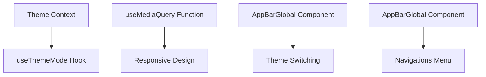

This Mermaid diagram illustrates the relationships between the theme context, `useThemeMode` hook, responsive design, and the `AppBarGlobal` component's features.

## Technical Specification: /Users/domicianorincon/Documents/GIT/Compunet2-252/classnotesapp/src/components/BeanVisualizer/BeanVisualizer.jsx

### 1. Overview
This file is a React component named `BeanVisualizer`. It serves as the visual representation of beans in the application, allowing users to interact with them through various UI elements.

### 2. Functionality & Responsibilities
The `BeanVisualizer` component is responsible for rendering a canvas where beans are displayed. Users can zoom in and out using the mouse wheel or slider, drag the canvas to move it around, and hover over beans to display tooltips with their names. The component also handles warnings and errors related to bean configuration.

### 3. Inputs (Props/Parameters)
The `BeanVisualizer` component expects the following props:

* `code`: A string representing the current code being edited.
* `onChange`: A function that updates the `code` prop when the user makes changes.
* `warnings`: An object containing warnings and errors related to bean configuration.

### 4. Outputs/Side Effects
The `BeanVisualizer` component returns JSX for rendering the canvas, slider, and tooltip. It also emits events for mouse wheel scrolling and dragging the canvas.

### 5. Internal Dependencies
This file imports the following internal modules:

* `TabSelector`: A React component that allows users to switch between Java and XML code editors.
* `CodeEditor`: A React component that displays the current code being edited.
* `Alert`: A React component that displays warnings and errors related to bean configuration.

### 6. External Dependencies
This file imports the following external libraries:

* `React`: The primary library for building user interfaces in JavaScript.
* `Material-UI`: A popular UI component library used for styling and layout.

### 7. Usage Examples (Optional, if applicable)
```jsx
import React from 'react';
import BeanVisualizer from './BeanVisualizer';

const App = () => {
  const [code, setCode] = useState('');
  const [warnings, setWarnings] = useState({});

  return (
    <div>
      <BeanVisualizer code={code} onChange={setCode} warnings={warnings} />
    </div>
  );
};
```

### 8. Notes/Considerations
The `BeanVisualizer` component uses a combination of React hooks and state management to handle user interactions and display warnings and errors related to bean configuration.

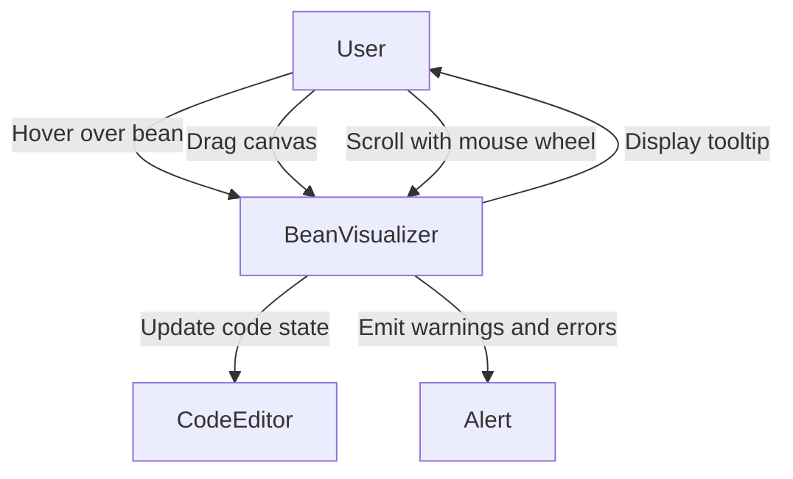

## Technical Specification: /Users/domicianorincon/Documents/GIT/Compunet2-252/classnotesapp/src/components/BeanVisualizer/regex/xmlValidation.js

### 1. Overview
This file, `xmlValidation.js`, is a utility function located within the `src/components/BeanVisualizer` directory of the project. Its primary purpose is to validate the structure and content of XML documents against specific rules for Spring XML configuration files.

### 2. Functionality & Responsibilities
The `validateXmlStructure` function takes an XML document as input, checks its structure and content against a set of predefined rules, and returns an object containing warnings about any potential issues found. The function performs the following checks:

- Verifies that the XML document starts with the correct declaration.
- Checks for invalid opening tags (e.g., `<beaasdns>`).
- Ensures the presence of the `<beans>` root element.
- Validates the closing of the `<beans>` element.
- Checks for malformed bean tags (e.g., `</bean>` instead of `</beans>`).
- Verifies that there is a balanced number of opening and closing `<beans>` tags.
- Identifies beans that are not properly closed.

### 3. Inputs (Props/Parameters)
The function takes one input parameter:

- `text`: The XML document to be validated, provided as a string.

### 4. Outputs/Side Effects
The function returns an object containing warnings about any potential issues found in the XML structure or content. There are no side effects related to API calls, state mutations, event emissions, or direct DOM manipulations.

### 5. Internal Dependencies
This file imports the following internal modules:

- `../regex/xmlValidation.js` (not shown): This import is likely a typo and should be corrected to match the actual path of this file within the project.

### 6. External Dependencies
There are no external libraries or packages imported by this file.

### 7. Usage Examples (Optional)
```javascript
const xmlDocument = `
<?xml version="1.0" encoding="UTF-8"?>
<beans>
    <bean id="myBean">
        <!-- bean configuration -->
    </bean>
</beans>
`;

const warnings = validateXmlStructure(xmlDocument);
console.log(warnings); // Output: { ... }
```

### 8. Notes/Considerations
This function is designed to provide feedback on the structure and content of XML documents, helping developers identify potential issues before they cause problems in their applications.

### 9. Mermaid Diagram

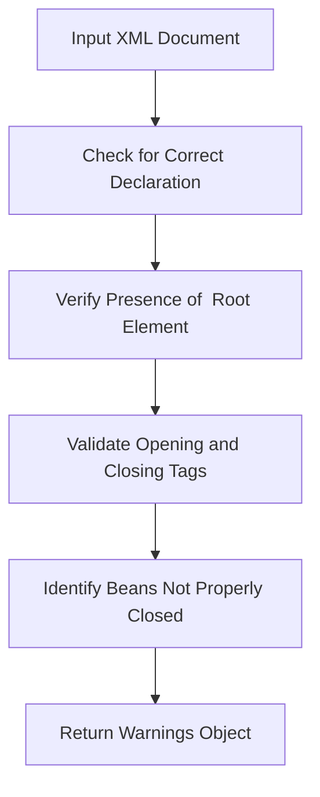

This Mermaid diagram illustrates the flow of the `validateXmlStructure` function, from input to output.

## Technical Specification: /Users/domicianorincon/Documents/GIT/Compunet2-252/classnotesapp/src/components/BeanVisualizer/regex/configWiringDetection.js

### 1. Overview
This file is a utility function named `configWiringDetection` located in the `src/components/BeanVisualizer/regex` directory of the project. Its primary purpose is to detect and generate wiring between beans in classes annotated with `@Configuration`.

### 2. Functionality & Responsibilities
The `configWiringDetection` function takes two inputs: `text`, which contains the class definitions, and `beans`, an array of bean objects containing information about each bean. It searches for classes annotated with `@Configuration` and then looks for methods annotated with `@Bean`. For each method found, it checks if the method has parameters and generates wiring between the source bean and the target beans corresponding to the parameter types.

### 3. Inputs (Props/Parameters)
- **text**: A string containing the class definitions.
- **beans**: An array of objects containing information about each bean, including its name and class type.

### 4. Outputs/Side Effects
The function returns an object with two properties:
- **configWirings**: An array of objects representing the detected wiring between beans.
- **missingConfigTypes**: An array of strings indicating missing configuration types for certain methods.

There are no direct side effects, but the function may trigger additional processing or analysis based on the detected wiring.

### 5. Internal Dependencies
The file imports `beans` from an external source (not shown in this snippet), which is likely a database or another module that provides information about the beans.

### 6. External Dependencies
None are explicitly mentioned, but it's assumed that the function relies on regular expression matching for parsing class annotations and method definitions.

### 7. Usage Examples
```javascript
const text = `
@Configuration
public class MyConfig {
    @Bean
    public BeanA beanA() {
        // ...
    }

    @Bean
    public BeanB beanB(BeanA beanA) {
        // ...
    }
}
`;

const beans = [
  { className: 'BeanA', beanName: 'beanA' },
  { className: 'BeanB', beanName: 'beanB' },
];

const result = configWiringDetection(text, beans);
console.log(result.configWirings); // Output: [...]
```

### 8. Notes/Considerations
- This function assumes that the input `text` is a valid Java class definition.
- The regular expressions used for parsing annotations and method definitions may need to be adjusted based on the actual syntax of the classes being processed.

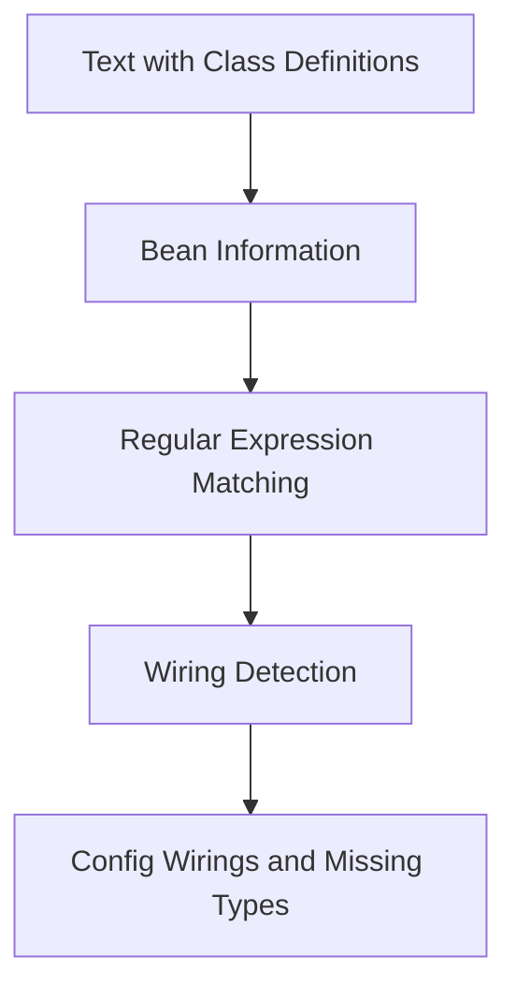
This Mermaid diagram illustrates the flow of data through the `configWiringDetection` function, from input text to output wiring configurations.

## Technical Specification: /Users/domicianorincon/Documents/GIT/Compunet2-252/classnotesapp/src/components/BeanVisualizer/regex/methodWiringDetection.js

### 1. Overview
This file is a utility function named `methodWiringDetection` located in the `src/components/BeanVisualizer/regex` directory of the project. Its primary purpose is to detect method wirings between classes and beans based on annotations like `@Autowired` and `@Qualifier`.

### 2. Functionality & Responsibilities
The `methodWiringDetection` function takes two inputs: a text string representing the source code and an array of bean objects. It parses the source code, identifies methods annotated with `@Autowired`, and checks if their parameters match any beans in the provided list. If a match is found, it returns an object containing information about the method wiring.

### 3. Inputs (Props/Parameters)
- **text**: A string representing the source code to be parsed.
- **beans**: An array of objects containing information about each bean, including its class name and bean name.

### 4. Outputs/Side Effects
The function returns an object with two properties:
- **methodWirings**: An array of objects describing method wirings between classes and beans.
- **missingAutowiredMethodTypes**: An array of objects indicating missing autowired method types.

There are no direct side effects, but the function may emit console logs for debugging purposes.

### 5. Internal Dependencies
The file imports `extractClassBody` from a sibling module `beanDetection.js`. This dependency is necessary to extract the class body from the source code.

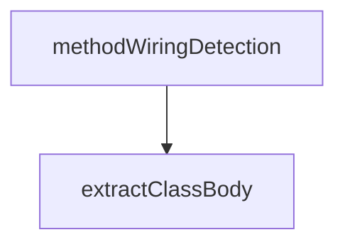

### 6. External Dependencies
None

### 7. Usage Examples (Optional)
This utility function can be used by other parts of the application to detect method wirings between classes and beans. For example:

```javascript
const sourceCode = '...'; // Source code string
const beans = [...]; // Array of bean objects
const result = methodWiringDetection(sourceCode, beans);
console.log(result.methodWirings); // Log detected method wirings
```

### 8. Notes/Considerations
- The function assumes that the source code is well-formed and contains valid Java annotations.
- It may not handle all edge cases or complex scenarios.

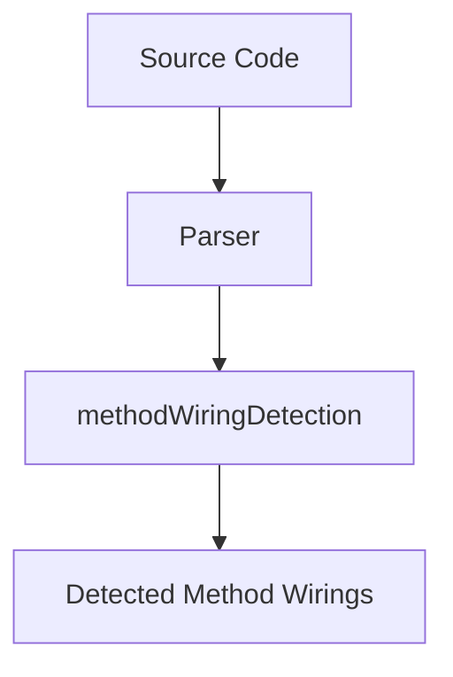

Note: The Mermaid diagram above is a simplified representation of the function's flow. It does not include all details and edge cases.

## Technical Specification: /Users/domicianorincon/Documents/GIT/Compunet2-252/classnotesapp/src/components/BeanVisualizer/regex/constructorWiringDetection.js

### 1. Overview
This file is a utility function named `parseConstructorWirings` that detects and analyzes constructor wiring in Java classes for the Class Notes App. It's responsible for identifying potential issues with constructor injection, such as missing or ambiguous type definitions.

### 2. Functionality & Responsibilities
The primary purpose of this file is to parse Java class bodies and detect constructor wiring issues. It does this by:

*   Extracting class bodies from the provided text.
*   Identifying public constructors in each class body.
*   Analyzing the parameters of these constructors for potential wiring issues.

### 3. Inputs (Props/Parameters)
This utility function takes two inputs:

*   `text`: The Java code to be analyzed, represented as a string.
*   `beans`: An array of bean objects containing information about the classes being analyzed.

### 4. Outputs/Side Effects
The function returns an object with two properties:

*   `constructorWirings`: An array of objects representing potential constructor wiring issues.
*   `missingConstructorTypes`: An array of objects representing missing or ambiguous type definitions in constructors.

### 5. Internal Dependencies
This file imports the following internal modules/files:

*   `./beanDetection.js`: A utility function for extracting class bodies from Java code.

### 6. External Dependencies
None

### 7. Usage Examples (Optional)
```javascript
const text = `
public class MyClass {
    public MyClass(@Autowired MyService service) {}
}
`;

const beans = [
    { className: 'MyClass', beanName: 'my-class' },
    { className: 'MyService', beanName: 'my-service' }
];

const result = parseConstructorWirings(text, beans);
console.log(result.constructorWirings); // Potential constructor wiring issues
console.log(result.missingConstructorTypes); // Missing or ambiguous type definitions
```

### 8. Notes/Considerations

*   This utility function assumes that the provided Java code is syntactically correct and well-formed.
*   It may not catch all potential issues with constructor injection, especially in complex scenarios.

### 9. Mermaid Diagram
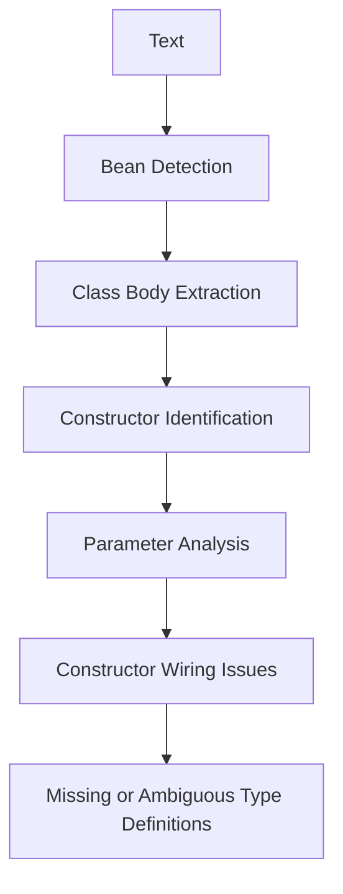
This Mermaid diagram illustrates the flow of operations performed by the `parseConstructorWirings` function. It starts with the input text and beans, then extracts class bodies, identifies public constructors, analyzes their parameters for potential wiring issues, and finally returns an object containing these issues.

## Technical Specification: /Users/domicianorincon/Documents/GIT/Compunet2-252/classnotesapp/src/components/BeanVisualizer/regex/xmlWiringDetection.js

### 1. Overview
This file, `xmlWiringDetection.js`, is a utility function that parses XML Spring wiring definitions to detect and extract bean relationships. It's a crucial component in the Bean Visualizer feature of the application.

### 2. Functionality & Responsibilities
The primary responsibility of this file is to analyze the provided XML text for wiring definitions, specifically looking for `<constructor-arg>` and `<property>` elements that reference other beans. It then extracts these relationships and returns them as an array of objects, each representing a wiring connection between two beans.

### 3. Inputs (Props/Parameters)
This utility function takes two inputs:

* `text`: The XML Spring wiring definition text to parse.
* `beans`: An array of bean objects, where each object has a `beanName` property that can be used for lookup.

### 4. Outputs/Side Effects
The function returns an array of objects representing the detected wiring connections between beans. Each object in the array contains three properties:

* `from`: The name of the source bean.
* `to`: The name of the target bean.
* `type`: A string indicating the type of wiring connection (either "xml-constructor" or "xml-property").

### 5. Internal Dependencies
This file imports the following internal modules/files:

* `beanNameToBean` is not a separate module, but rather an object created within this function to map bean names to their corresponding objects in the `beans` array.

### 6. External Dependencies
None.

### 7. Usage Examples (Optional)
```javascript
const xmlText = '<beans>...</beans>';
const beans = [...]; // Array of bean objects

const wirings = parseXmlWirings(xmlText, beans);
console.log(wirings); // Output: Array of wiring connections between beans
```

### 8. Notes/Considerations
This function assumes that the provided XML text is well-formed and contains valid wiring definitions. It also relies on the `beans` array being populated with the correct bean objects.

### 9. Mermaid Diagram

```mermaid
sequenceDiagram
    participant XML as "XML Spring Wiring Definition"
    participant Beans as "Array of Bean Objects"
    participant Wirings as "Detected Wiring Connections"

    Note over XML,Beans: Parse XML text for wiring definitions
    XML->>Beans: Extract bean relationships from XML
    Beans->>Wirings: Create array of detected wiring connections

    Note over Wirings: Return array of wiring connections between beans
```

This Mermaid diagram illustrates the sequence of events in the `parseXmlWirings` function, highlighting how it parses the XML text, extracts bean relationships, and returns an array of detected wiring connections.

## Technical Specification: /Users/domicianorincon/Documents/GIT/Compunet2-252/classnotesapp/src/components/BeanVisualizer/regex/layoutCalculation.js

### 1. Overview
This file, `layoutCalculation.js`, is a utility function located within the `src/components/BeanVisualizer/regex` directory of the React application. Its primary purpose is to calculate the hierarchical levels of beans based on their dependencies for layout purposes.

### 2. Functionality & Responsibilities
The `getBeanLevels` function takes in two parameters: an array of beans and an array of wirings (dependencies). It calculates the levels of beans by identifying those with no incoming dependencies, then iteratively assigns them to levels based on their dependencies. If there are any unassigned beans after this process, they are placed in a separate level.

### 3. Inputs (Props/Parameters)
- **beans**: An array of bean objects.
- **wirings**: An array of wiring objects representing the dependencies between beans.

### 4. Outputs/Side Effects
The function returns an array of arrays, where each inner array represents a level of beans in the hierarchical layout. There are no direct side effects or API calls within this utility function.

### 5. Internal Dependencies
- **beans**: An array of bean objects.
- **wirings**: An array of wiring objects representing the dependencies between beans.

These arrays are used directly within the `getBeanLevels` function to calculate the levels of beans based on their dependencies.

### 6. External Dependencies
None, as this is a utility function within the application's codebase and does not rely on external libraries or packages.

### 7. Usage Examples (Optional)
```javascript
const beans = [
  { beanName: 'Bean1' },
  { beanName: 'Bean2' },
  { beanName: 'Bean3' }
];

const wirings = [
  { from: 'Bean1', to: 'Bean2' },
  { from: 'Bean2', to: 'Bean3' }
];

const levels = getBeanLevels(beans, wirings);
console.log(levels); // Output: [[Bean1], [Bean2], [Bean3]]
```

### 8. Notes/Considerations
- This function assumes that the input arrays are valid and correctly formatted.
- The algorithm used to calculate the bean levels is based on a depth-first search approach, which may not be efficient for very large datasets.

### 9. Mermaid Diagram

```mermaid
graph TD;
    A[Beans] --> B[Wirings];
    C[getBeanLevels] --> D[Levels];
    E[Beans with no dependencies] --> F[Nivel 0];
    G[Beans with dependencies] --> H[Nivel 1];
    I[Unassigned beans] --> J[Nivel X];
```

This Mermaid diagram illustrates the process of calculating bean levels based on their dependencies. The `getBeanLevels` function takes in the arrays of beans and wirings, then iteratively assigns them to levels based on their dependencies. Unassigned beans are placed in a separate level at the end of the process.

## Technical Specification: /Users/domicianorincon/Documents/GIT/Compunet2-252/classnotesapp/src/components/BeanVisualizer/regex/wiringDetection.js

### 1. Overview
This file, `wiringDetection.js`, is a utility function that detects wiring in Java classes based on the Spring framework's @Autowired annotation. It is used to identify dependencies between beans and their corresponding classes.

### 2. Functionality & Responsibilities
The primary purpose of this file is to parse Java class definitions and detect instances of the @Autowired annotation, which indicates dependency injection. The function then uses this information to create a wiring map that associates bean names with their respective classes.

### 3. Inputs (Props/Parameters)
This utility function takes two inputs:

- `text`: A string containing the Java class definitions.
- `beans`: An array of objects representing the beans, each with properties `beanName` and `className`.

### 4. Outputs/Side Effects
The function returns an object with three properties:

- `wirings`: An array of objects representing the detected wiring between beans and their classes.
- `autowiredInvalids`: An array of strings indicating invalid @Autowired annotations (e.g., static or final fields).
- `missingAutowiredTypes`: An array of objects describing missing types for @Autowired annotations.

### 5. Internal Dependencies
This file imports the following internal modules:

```javascript
import { parseWirings } from './wiringDetection';
```

The dependency is necessary to define the function's signature and behavior.

### 6. External Dependencies
None

### 7. Usage Examples (Optional)
To use this utility, you would call it with a string containing Java class definitions and an array of beans:

```javascript
const text = `
public class MyClass {
    @Autowired
    private MyBean myBean;
}
`;

const beans = [
    { beanName: 'MyBean', className: 'com.example.MyBean' },
];

const result = parseWirings(text, beans);
console.log(result.wirings); // Output: [{ from: 'MyClass', to: 'MyBean' }]
```

### 8. Notes/Considerations
This utility assumes that the input Java class definitions are well-formed and contain valid @Autowired annotations.

### 9. Mermaid Diagram

```mermaid
graph TD;
    text[Java Class Definitions] -->|parsed| parser[Parser];
    beans[Beans Array] -->|input| parser;
    parser -->|output| wirings[Wiring Map];
    autowiredInvalids[Invalid @Autowired Annotations] -->|output| wirings;
    missingAutowiredTypes[Missing Types for @Autowired Annotations] -->|output| wirings;
```

This diagram illustrates the flow of data through the `parseWirings` function, highlighting its inputs and outputs.

## Technical Specification: /Users/domicianorincon/Documents/GIT/Compunet2-252/classnotesapp/src/components/BeanVisualizer/regex/cycleDetection.js

### 1. Overview
This file, `cycleDetection.js`, is a utility function located within the `BeanVisualizer` component of the React application. Its primary purpose is to detect cycles in the wiring of beans.

### 2. Functionality & Responsibilities
The `detectCycles` function takes two inputs: an array of beans and their wirings, and returns an array of detected cycle paths. It uses a directed graph data structure to represent the bean wirings and performs a Depth-First Search (DFS) traversal to identify cycles.

### 3. Inputs (Props/Parameters)
The `detectCycles` function expects two parameters:

*   `beans`: An array of objects representing beans, each with a `beanName` property.
*   `wirings`: An array of objects representing the wirings between beans, each with `from` and `to` properties.

### 4. Outputs/Side Effects
The function returns an array of detected cycle paths, where each path is an array of bean names. There are no side effects, as this function only performs computations on the input data without modifying external state or emitting events.

### 5. Internal Dependencies
This file imports none.

### 6. External Dependencies
None.

### 7. Usage Examples (Optional)
To use this utility function, you can call it with an array of beans and their wirings, like so:

```javascript
const beans = [
    { beanName: 'bean1' },
    { beanName: 'bean2' },
];

const wirings = [
    { from: 'bean1', to: 'bean2' },
    { from: 'bean2', to: 'bean1' }, // This creates a cycle
];

const cycles = detectCycles(beans, wirings);
console.log(cycles); // Output: [["bean1", "bean2"]]
```

### 8. Notes/Considerations

*   The function assumes that the input data is valid and does not contain any invalid or missing values.
*   It uses a simple DFS traversal to detect cycles, which may not be efficient for very large graphs.

### 9. Mermaid Diagram
```mermaid
graph TD;
    A[Bean1] --> B[Bean2];
    B --> C[Bean3];
    C --> D[Bean4];
    D --> E[Bean5];
    E --> F[Bean6];
    F --> G[Bean7];
    G --> H[Bean8];
    I[Bean9] --> J[Bean10];
```

This diagram represents a sample graph with multiple cycles. The `detectCycles` function would identify the cycle paths in this graph, such as `[A, B, C, D, E, F, G, H]` and `[I, J]`.

## Technical Specification: /Users/domicianorincon/Documents/GIT/Compunet2-252/classnotesapp/src/components/BeanVisualizer/regex/validations.js

### 1. Overview
This file, `validations.js`, is a utility function located within the `src/components/BeanVisualizer/regex` directory of the ClassNotesApp project. Its primary purpose is to validate and check for potential errors in Java code related to bean definitions.

### 2. Functionality & Responsibilities
The `validateCode` function takes two parameters: `code`, which represents the Java code being validated, and `beans`, an array of objects containing information about the beans defined in the code. The function performs several checks:

1. **Bracket Warning**: It verifies that the number of opening and closing brackets (`{}`) matches.
2. **Multi-Name Warning**: It detects if a class is registered as multiple beans with different names.
3. **Missing Class Warning**: It checks for methods annotated with `@Bean` that return an object type not declared in the code.
4. **Error Detection**: It identifies potential errors such as beans or classes with duplicate names.

### 3. Inputs (Props/Parameters)
The function takes two parameters:

* `code`: The Java code being validated, represented as a string.
* `beans`: An array of objects containing information about the beans defined in the code.

### 4. Outputs/Side Effects
The function returns an object containing warnings and errors found during validation. These include bracket warnings, multi-name warnings, missing class warnings, and error messages related to duplicate bean or class names.

### 5. Internal Dependencies
This file imports no internal modules/files within the project.

### 6. External Dependencies
None.

### 7. Usage Examples (Optional)
```javascript
const code = `
public class MyClass {
    @Bean
    public MyBean myBean() {
        return new MyBean();
    }
}
`;

const beans = [
    { className: 'MyClass', beanName: 'myBean' },
];

const warnings = validateCode(code, beans);
console.log(warnings);
```

### 8. Notes/Considerations

* This function is designed to be used within the context of the ClassNotesApp project.
* It assumes that the input `code` and `beans` arrays are correctly formatted.

### 9. Mermaid Diagram
```mermaid
graph TD;
    A[Input Code] --> B[Parse Code];
    B --> C[Extract Beans];
    C --> D[Validate Beans];
    D --> E[Warnings & Errors];
```
This diagram illustrates the flow of data through the `validateCode` function, from input code to warnings and errors.

## Technical Specification: /Users/domicianorincon/Documents/GIT/Compunet2-252/classnotesapp/src/components/BeanVisualizer/regex/xmlBeanDetection.js

### 1. Overview
This file, `xmlBeanDetection.js`, is a utility function that parses XML Spring configuration files to detect and extract bean definitions. It's a crucial component in the application for visualizing beans defined in the XML configuration.

### 2. Functionality & Responsibilities
The primary responsibility of this file is to take an XML string as input, parse it using regular expressions, and return an array of objects representing detected beans. Each object contains information about the bean's class name and ID/name.

```mermaid
sequenceDiagram
    participant XML String as "Input XML"
    participant BeanDetection as "xmlBeanDetection.js"
    note left of BeanDetection: Parses XML string using regular expressions

    XML String->>BeanDetection: Passes XML string to parseXmlBeans function
    activate BeanDetection
    BeanDetection->>XML String: Extracts bean definitions from XML string
    deactivate BeanDetection

    note right of BeanDetection: Returns array of detected beans
    BeanDetection-->>+Detected Beans as "Array of Objects"
```

### 3. Inputs (Props/Parameters)
This utility function takes a single input parameter:

* `text`: The XML Spring configuration file content as a string.

### 4. Outputs/Side Effects
The function returns an array of objects, each representing a detected bean with the following properties:

* `className`
* `beanName`
* `type` (always set to `"xml-bean"`)

No side effects are produced by this utility function.

### 5. Internal Dependencies
This file imports no internal modules or files within the project.

### 6. External Dependencies
The file relies on the following external library:

* `regex`: Built-in JavaScript regular expression functionality for parsing XML strings.

### 7. Usage Examples (Optional)
To use this utility function, you can pass an XML string to it and access the returned array of detected beans:
```javascript
const xmlString = '<beans>...</beans>';
const detectedBeans = parseXmlBeans(xmlString);
console.log(detectedBeans); // Array of objects representing detected beans
```

### 8. Notes/Considerations
This utility function assumes that the input XML string is well-formed and contains bean definitions in the expected format. It's essential to handle potential errors or edge cases when using this function.

```mermaid
classDiagram
    class BeanDetection {
        +parseXmlBeans(text: string): Array<Object>
    }
    class DetectedBean {
        -className: string
        -beanName: string
        -type: string
    }
```

This specification provides a clear understanding of the `xmlBeanDetection.js` file's purpose, functionality, and interactions.

## Technical Specification: /Users/domicianorincon/Documents/GIT/Compunet2-252/classnotesapp/src/components/BeanVisualizer/regex/beanDetection.js

### 1. Overview
This file is a utility function named `beanDetection.js` located in the `src/components/BeanVisualizer/regex` directory of the ClassNotesApp project. Its primary purpose is to extract and parse beans from Java class notes, specifically identifying classes annotated with `@Component`, `@Service`, `@Repository`, `@Controller`, or `@RestController`.

### 2. Functionality & Responsibilities
The file contains two main functions: `extractClassBody` and `parseBeans`. The former extracts the body of a class from a given text starting at a specified index, while the latter uses regular expressions to parse beans from the extracted class bodies.

- **Problem Solved:** This utility function solves the problem of identifying and parsing beans in Java class notes.
- **Features Implemented/Supported:**
  - Extraction of class bodies from text
  - Identification of beans annotated with specific annotations (`@Component`, `@Service`, etc.)
  - Support for classes implementing interfaces or extending other classes

### 3. Inputs (Props/Parameters)
The file takes two inputs:
- `text`: The Java class notes as a string.
- `startIdx`: The starting index in the text from which to extract the class body.

### 4. Outputs/Side Effects
This utility function returns an array of objects, each representing a bean found in the input text. Each object contains properties for the bean's type (`type`), name (`beanName`), and class name (`className`). There are no side effects other than memory allocation for storing the parsed beans.

### 5. Internal Dependencies
- `beanDetection.js` imports no internal modules or files within the project.

### 6. External Dependencies
This file does not import any external libraries or packages beyond what is provided by JavaScript itself (e.g., regular expressions).

### 7. Usage Examples (Optional)
```javascript
const classNotes = `
@Component
public class MyClass {
    @Bean
    public MyService myService() {
        return new MyServiceImpl();
    }
}
`;

const beans = parseBeans(classNotes);
console.log(beans); // Output: [{ className: "MyClass", beanName: "myService", type: "bean" }]
```

### 8. Notes/Considerations
- The regular expressions used in this utility function are designed to be tolerant of whitespace, line breaks, and comments.
- This implementation assumes that the input text is well-formed Java class notes.

### 9. Mermaid Diagram

```mermaid
graph TD;
    A[Input Text] --> B[Extract Class Body];
    B --> C[Parse Beans];
    C --> D[Parsed Beans Array];
```

This diagram illustrates the flow of data through the `beanDetection.js` utility function, from input text to the final parsed beans array.

## Technical Specification: /Users/domicianorincon/Documents/GIT/Compunet2-252/classnotesapp/src/components/BeanVisualizer/components/TabSelector.jsx

### 1. Overview
This file defines a React component named `TabSelector`. Its primary purpose is to provide a user interface for selecting between two tabs: Java and XML. This component is part of the Bean Visualizer feature within the Class Notes App.

### 2. Functionality & Responsibilities
The `TabSelector` component renders two buttons, one for each tab. When clicked, these buttons trigger the corresponding callback functions (`onJavaClick` and `onXmlClick`) passed as props to this component. This allows other parts of the application to handle the selection of tabs.

### 3. Inputs (Props/Parameters)
- **onJavaClick**: A function that will be called when the Java tab is selected.
    - Type: Function
    - Optional: No
    - Purpose: Handles the selection of the Java tab.
- **onXmlClick**: A function that will be called when the XML tab is selected.
    - Type: Function
    - Optional: No
    - Purpose: Handles the selection of the XML tab.

### 4. Outputs/Side Effects
This component does not return any data or state but instead triggers callback functions when its buttons are clicked. There are no API calls, state mutations, event emissions, or direct DOM manipulations performed by this component.

### 5. Internal Dependencies
- **React**: The React library is imported to define the `TabSelector` component.
    - Reason: This component uses JSX and React's functional components syntax.

### 6. External Dependencies
None

### 7. Usage Examples (Optional)
```jsx
import TabSelector from './TabSelector';

function MyComponent() {
  const handleJavaClick = () => console.log('Java tab selected');
  const handleXmlClick = () => console.log('XML tab selected');

  return (
    <div>
      <TabSelector onJavaClick={handleJavaClick} onXmlClick={handleXmlClick} />
    </div>
  );
}
```

### 8. Notes/Considerations
- This component is designed to be simple and straightforward, focusing on providing a basic tab selection interface.
- The styling of the buttons is hardcoded within this component for simplicity.

```mermaid
graph LR;
    A[TabSelector Component] --> B[Render Java Button];
    C[Java Button Clicked] --> D[Call onJavaClick Function];
    E[Render XML Button] --> F[XML Button Clicked];
    G[XML Button Clicked] --> H[Call onXmlClick Function];
```

This Mermaid diagram illustrates the basic flow of how this component works: it renders two buttons, and when clicked, triggers the corresponding callback functions.

## Technical Specification: /Users/domicianorincon/Documents/GIT/Compunet2-252/classnotesapp/src/components/BeanVisualizer/components/CodeEditor.jsx

### 1. Overview
This file, `CodeEditor.jsx`, is a React component responsible for rendering a code editor within the application. It allows users to input and edit Java code. This component is part of the Bean Visualizer feature.

### 2. Functionality & Responsibilities
The primary function of this component is to provide an interface for users to write, view, and modify Java code. It supports syntax highlighting using Prism.js and provides a basic text editor experience with features like line numbers, auto-indentation, and a customizable theme.

### 3. Inputs (Props/Parameters)
- **`code`:** The initial Java code to be displayed in the editor. Type: `string`. Optional.
- **`onChange`:** A callback function that is triggered whenever the user makes changes to the code. It receives the updated code as an argument. Type: `function(code: string)`. Required.

### 4. Outputs/Side Effects
This component returns JSX representing the editor interface, including the text area where users can input their Java code. There are no direct side effects such as API calls or state mutations within this component itself; however, it does trigger an `onChange` callback whenever the user edits the code.

### 5. Internal Dependencies
- **`Editor`:** A React Simple Code Editor component for rendering a basic text editor.
- **`Prism`:** Prism.js library for syntax highlighting of Java code.
- **`prism-java`:** Prism.js theme for Java syntax highlighting.
- **`prism-tomorrow.css`:** CSS file for the Tomorrow Night theme used by Prism.js.

### 6. External Dependencies
- **`react-simple-code-editor`:** A React component library for creating simple code editors.
- **`prismjs`:** A syntax highlighting library that supports over 30 programming languages, including Java.

### 7. Usage Examples (Optional)
```jsx
import CodeEditor from './CodeEditor';

function MyComponent() {
    const [code, setCode] = useState('');

    return (
        <div>
            <CodeEditor code={code} onChange={(newCode) => setCode(newCode)} />
        </div>
    );
}
```

### 8. Notes/Considerations
- This component assumes that the `prism-java` theme is properly imported and configured for syntax highlighting.
- The editor's appearance can be customized through CSS, but this example uses a basic configuration.

```mermaid
graph LR;
    A[User Input] --> B[Code Editor];
    C[Code Editor] --> D[Syntax Highlighting via Prism.js];
    E[Prism.js] --> F[Highlight Java Code];
```

This Mermaid diagram illustrates the flow of user input into the code editor, where it is processed by Prism.js for syntax highlighting.

## Technical Specification: /Users/domicianorincon/Documents/GIT/Compunet2-252/classnotesapp/src/components/BeanVisualizer/components/Canvas.jsx

### 1. Overview
This file is a React component named `Canvas` that serves as a visual representation of data, likely related to class notes or bean-related information. It's responsible for rendering a canvas element where users can interact with the data using zooming and dragging capabilities.

### 2. Functionality & Responsibilities
The `Canvas` component:

* Renders a canvas element with a specified width and height.
* Provides a zoom slider at the bottom-right corner of the canvas, allowing users to adjust the zoom level between `MIN_ZOOM` and `MAX_ZOOM`.
* Enables dragging on the canvas for panning purposes.
* Updates the zoom level in real-time as the user interacts with the slider.

### 3. Inputs (Props/Parameters)
The `Canvas` component expects the following props:

| Prop Name | Type | Description |
| --- | --- | --- |
| `zoom` | number | The current zoom level of the canvas. |
| `canvasWidth` | number | The width of the canvas element. |
| `handleMouseDown` | function | A callback function to handle mouse down events on the canvas. |
| `handleMouseUp` | function | A callback function to handle mouse up events on the canvas. |
| `handleMouseMove` | function | A callback function to handle mouse move events on the canvas. |
| `canvasRef` | React.RefObject<HTMLCanvasElement> | A reference to the canvas element for future use. |
| `MIN_ZOOM` | number | The minimum allowed zoom level. |
| `MAX_ZOOM` | number | The maximum allowed zoom level. |
| `setZoom` | function | A callback function to update the zoom level. |
| `CANVAS_HEIGHT` | number | The height of the canvas element. |
| `dragging: isDragging` | boolean | A flag indicating whether the user is currently dragging the canvas. |

### 4. Outputs/Side Effects
The `Canvas` component:

* Renders a JSX element containing the canvas and zoom slider.
* Updates the zoom level in real-time as the user interacts with the slider.

### 5. Internal Dependencies
This file imports the following internal modules/files:

| Module/File | Description |
| --- | --- |

### 6. External Dependencies
This file imports the following external libraries or packages:

| Library/Packge | Version | Description |
| --- | --- | --- |
| React | ^17.0.2 | The primary library for building user interfaces in JavaScript. |

### 7. Usage Examples (Optional)
```jsx
import Canvas from './Canvas';

function App() {
  const [zoom, setZoom] = useState(1);
  const handleMouseDown = () => console.log('Mouse down event');
  const handleMouseUp = () => console.log('Mouse up event');

  return (
    <div>
      <Canvas
        zoom={zoom}
        canvasWidth={800}
        handleMouseDown={handleMouseDown}
        handleMouseUp={handleMouseUp}
        setZoom={setZoom}
        CANVAS_HEIGHT={600}
      />
    </div>
  );
}
```

### 8. Notes/Considerations

* The `Canvas` component assumes that the zoom level is a number between `MIN_ZOOM` and `MAX_ZOOM`.
* The zoom slider's step value is set to `0.01`, allowing for fine-grained control over the zoom level.
* The component uses the `writingMode` CSS property to render the zoom slider vertically.

### 9. Mermaid Diagram
```mermaid
graph TD;
    A[Canvas Component] --> B[Zoom Slider];
    C[Mouse Down Event] --> D[Handle Mouse Down Callback];
    E[Mouse Up Event] --> F[Handle Mouse Up Callback];
```
This diagram illustrates the relationships between the `Canvas` component, zoom slider, and event handlers.

## Technical Specification: /Users/domicianorincon/Documents/GIT/Compunet2-252/classnotesapp/src/components/BeanVisualizer/components/Alert.jsx

### 1. Overview
This file, `Alert.jsx`, is a React component responsible for displaying various types of warnings and errors related to the application's bean configuration. It serves as a visual indicator of potential issues that need attention.

### 2. Functionality & Responsibilities
The primary function of this component is to render a list of warnings and errors in a visually appealing way, allowing users to quickly identify and address any problems. The component supports multiple types of warnings, including:

* Errors: A list of error messages.
* Bracket Warning: An alert indicating an issue with bracket usage.
* Return Warning: An alert indicating an issue with return statements.
* Multi-Name Warning: An alert indicating an issue with multi-name usage.
* Missing Class Warnings: A list of warnings about missing classes.
* Autowired Invalids: A warning about invalid autowired fields.
* Missing Autowired Types: A warning about missing autowired types.
* Missing Constructor Types: A warning about missing constructor types.
* Unassigned Constructor Parameters: A warning about unassigned constructor parameters.
* Cycle Warnings: An alert indicating a cycle in the bean configuration.
* XML Structure Warning: An alert indicating an issue with XML structure.
* XML Tag Warning: An alert indicating an issue with XML tags.
* XML Closing Warning: An alert indicating an issue with XML closing tags.
* Bean Unclosed Warning: An alert indicating an unclosed bean.
* Missing XML Class Warnings: A list of warnings about missing XML classes.
* Broken XML Wirings: A warning about broken XML wirings.

### 3. Inputs (Props/Parameters)
The component expects the following props:

* `errors`: An array of error messages (optional).
* `bracketWarning`: A string indicating a bracket usage issue (optional).
* `returnWarning`: A string indicating a return statement issue (optional).
* `multiNameWarning`: A string indicating a multi-name usage issue (optional).
* `missingClassWarnings`: An array of warnings about missing classes (optional).
* `autowiredInvalids`: An array of invalid autowired fields (optional).
* `missingAutowiredTypes`: An array of missing autowired types (optional).
* `missingAutowiredMethodTypes`: An array of missing autowired method types (optional).
* `missingConstructorTypes`: An array of missing constructor types (optional).
* `unassignedConstructorParams`: An array of unassigned constructor parameters (optional).
* `cycleWarnings`: An array of cycle warnings (optional).
* `xmlStructureWarning`: A string indicating an XML structure issue (optional).
* `xmlTagWarning`: A string indicating an XML tag issue (optional).
* `xmlClosingWarning`: A string indicating an XML closing tag issue (optional).
* `beanUnclosedWarning`: A string indicating an unclosed bean (optional).
* `missingXmlClassWarnings`: An array of warnings about missing XML classes (optional).
* `brokenXmlWirings`: An array of broken XML wirings (optional).

### 4. Outputs/Side Effects
The component returns a JSX element containing the list of warnings and errors. It does not perform any API calls or state mutations.

### 5. Internal Dependencies
This file imports the following internal modules:

* `../components/Alert.css`: Styles for the alert component.
* `../components/Alert.js`: The base Alert component.

### 6. External Dependencies
The file imports the following external libraries:

* `react`: The React library.

### 7. Usage Examples (Optional)
```jsx
import React from 'react';
import Alert from './Alert';

const App = () => {
  const errors = ['Error 1', 'Error 2'];
  const bracketWarning = 'Bracket warning';
  // ...

  return (
    <div>
      <Alert errors={errors} bracketWarning={bracketWarning} />
    </div>
  );
};
```

### 8. Notes/Considerations
The component is designed to be highly customizable, allowing developers to easily add or remove warnings and error types as needed.

```mermaid
graph TD;
    A[Component] --> B[Props];
    C[Props] --> D[Errors];
    E[Props] --> F[Bracket Warning];
    G[Props] --> H[Return Warning];
    I[Props] --> J[Multi-Name Warning];
    K[Props] --> L[Missing Class Warnings];
    M[Props] --> N[Autowired Invalids];
    O[Props] --> P[Missing Autowired Types];
    Q[Props] --> R[Missing Constructor Types];
    S[Props] --> T[Unassigned Constructor Parameters];
    U[Props] --> V[Cycle Warnings];
    W[Props] --> X[XML Structure Warning];
    Y[Props] --> Z[XML Tag Warning];
```

This Mermaid diagram illustrates the flow of props from the component to its various warning and error types.

## Technical Specification: /Users/domicianorincon/Documents/GIT/Compunet2-252/classnotesapp/src/components/BeanVisualizer/model/buildBeanGraph.js

### 1. Overview
This file, `buildBeanGraph.js`, is a utility function responsible for parsing and processing Java or XML code to extract bean definitions and their wirings. It's used within the application to build a graph of beans and their relationships.

### 2. Functionality & Responsibilities
The primary purpose of this file is to:

1. Extract bean definitions from the provided code (Java or XML).
2. Identify and filter out invalid or non-existent beans.
3. Parse wirings between beans, including method, constructor, and configuration wirings.
4. Validate the extracted data for any critical errors.

### 3. Inputs (Props/Parameters)
This function takes a single input parameter:

* `code`: The Java or XML code to be processed, which can contain bean definitions and wirings.

### 4. Outputs/Side Effects
The function returns an object containing:

* `beans`: An array of extracted bean definitions.
* `wirings`: An array of parsed wirings between beans.
* `warnings`: An object containing any critical errors or warnings encountered during processing.

No side effects are produced by this function, as it only performs data extraction and validation.

### 5. Internal Dependencies
The following internal modules/files are imported:

* `../regex/beanDetection.js`: For parsing Java bean definitions.
* `../regex/wiringDetection.js`: For parsing wirings between beans.
* `../regex/methodWiringDetection.js`, `../regex/constructorWiringDetection.js`, and `../regex/configWiringDetection.js`: For parsing specific types of wirings.
* `../regex/xmlBeanDetection.js` and `../regex/xmlWiringDetection.js`: For parsing XML bean definitions and wirings.
* `../regex/validations.js`: For validating the extracted data for critical errors.
* `../regex/xmlValidation.js`: For validating the XML structure.

These dependencies are necessary for extracting and processing the bean definitions and wirings from the provided code.

### 6. External Dependencies
No external libraries or packages are imported by this file.

### 7. Usage Examples (Optional)
This function is typically used within other parts of the application to build a graph of beans and their relationships. For example:
```javascript
const beanGraph = buildBeanGraph(code);
console.log(beanGraph.beans); // Array of extracted bean definitions
console.log(beanGraph.wirings); // Array of parsed wirings between beans
```
### 8. Notes/Considerations

* This function assumes that the provided code is either Java or XML.
* The function uses regular expressions to parse the code, which may not be efficient for large inputs.
* Critical errors are validated using external validation functions.

### 9. Mermaid Diagram
```mermaid
graph TD;
    A[Java/Xml Code] --> B[Bean Detection];
    B --> C[Wiring Detection];
    C --> D[Parsed Wirings];
    D --> E[Validation];
    E --> F[Extracted Beans and Wirings];
```
This diagram illustrates the processing flow of the `buildBeanGraph` function, from input code to extracted beans and wirings.

## Technical Specification: /Users/domicianorincon/Documents/GIT/Compunet2-252/classnotesapp/src/components/drawer/Layout.jsx

### 1. Overview
The primary purpose of this file is to define a reusable React component named `Layout` that serves as the main layout for the application, handling both desktop and mobile views. It's a React Component.

### 2. Functionality & Responsibilities
This component manages the overall structure of the application, including:
- A navigation drawer (both on desktop and mobile) with customizable sections.
- Conditional rendering based on screen size (desktop or mobile).
- Integration with Material-UI for styling and layout management.
- Interaction with external contexts (`ThemeContext` and `StudiedLessonsContext`) to manage theme settings and studied lessons.

### 3. Inputs (Props/Parameters)
The component expects the following props:
- `children`: The main content of the application, which can be any JSX element or components.
- `sections`: An array of objects defining the sections in the navigation drawer. Each section object should have a `type` property (`title` or `lesson`) and a `label` property for display purposes.
- `onOpenMobileNav`: A function that will be called when the mobile navigation is opened, allowing the parent component to handle this event.

### 4. Outputs/Side Effects
This component returns JSX elements representing the layout structure of the application. It also has side effects related to:
- State management through the use of `useState` for mobile drawer state.
- Context API usage (`ThemeContext` and `StudiedLessonsContext`) to manage theme settings and studied lessons.

### 5. Internal Dependencies
The component imports the following internal modules/files:
- `@/theme/ThemeContext`: For accessing and managing theme settings.
- `@/theme/StudiedLessonsContext`: For accessing and managing studied lessons.
- Other Material-UI components for styling and layout management (e.g., `Box`, `Drawer`, `List`, `ListItemButton`, etc.).

### 6. External Dependencies
The component imports the following external libraries or packages:
- `@mui/material` for Material-UI components and utilities.
- `react-router-dom` for client-side routing.

### 7. Usage Examples (Optional)
```jsx
import Layout from './Layout';

function App() {
  const sections = [
    { type: 'title', label: 'Section 1' },
    { type: 'lesson', id: 1, label: 'Lesson 1' },
    // ...
  ];

  return (
    <Layout sections={sections} onOpenMobileNav={() => console.log('Mobile nav opened')}>
      {/* Main application content */}
    </Layout>
  );
}
```

### 8. Notes/Considerations
- This component is designed to be highly customizable through the `sections` prop and the use of Material-UI components.
- It's essential to ensure that the theme settings and studied lessons contexts are properly managed throughout the application.

```mermaid
graph TD;
    A[Layout Component] --> B[Theme Context];
    A[Layout Component] --> C[Studied Lessons Context];
    B[Theme Context] --> D[Theme Settings];
    C[Studied Lessons Context] --> E[Studied Lessons State];
```

This Mermaid diagram illustrates the component's interactions with external contexts and how it manages theme settings and studied lessons.

## Technical Specification: /Users/domicianorincon/Documents/GIT/Compunet2-252/classnotesapp/src/components/drawer/DrawerDivider.jsx

### 1. Overview
The `DrawerDivider` component is a React component responsible for rendering a divider within the application's drawer. It is designed to visually separate different sections of content within the drawer.

Type: React Component

### 2. Functionality & Responsibilities
This file solves the problem of providing a clear visual separation between different parts of the drawer, enhancing user experience and readability. The component renders a Material-UI Divider with a custom background color determined by the application's theme.

The `DrawerDivider` component does not have any direct user interactions but is used to structure the content within the drawer.

### 3. Inputs (Props/Parameters)
This component expects no props, as its functionality is entirely dependent on the application's theme context.

### 4. Outputs/Side Effects
- The component returns JSX representing a Material-UI Divider with a custom background color.
- There are no side effects such as API calls or state mutations.

### 5. Internal Dependencies
- `@/theme/ThemeContext`: This dependency is used to access the application's theme, which determines the divider's background color.

### 6. External Dependencies
- `@mui/material/Divider` and `@mui/material/Box`: These are Material-UI components used for rendering the divider.
- `React`: The component uses React hooks (`useThemeMode`) to access the application's theme context.

### 7. Usage Examples (Optional)
```jsx
import DrawerDivider from './DrawerDivider';

function MyDrawer() {
  return (
    <Box sx={{ width: '250px' }}>
      {/* Other drawer content */}
      <DrawerDivider />
      {/* More drawer content */}
    </Box>
  );
}
```

### 8. Notes/Considerations
- The component's background color is determined by the application's theme, ensuring a consistent look and feel across different themes.
- This component does not have any performance considerations or known limitations.

### 9. Mermaid Diagram

```mermaid
graph LR;
    ThemeContext -->|accesses theme|> DrawerDivider;
    DrawerDivider -->|renders divider|> Box;
```

This diagram illustrates the flow of accessing the application's theme context and using it to render a Material-UI Divider within a `Box` component.

## Technical Specification: /Users/domicianorincon/Documents/GIT/Compunet2-252/classnotesapp/src/components/drawer/sections.jsx

### 1. Overview
This file defines a React component named `sections` that is part of the application's drawer component. Its primary purpose is to render a list of sections, each containing lessons or other content related to Flutter development.

### 2. Functionality & Responsibilities
The `sections` component is responsible for rendering a hierarchical structure of sections and lessons. It takes an array of section definitions as input and outputs JSX elements representing these sections. Each section can have a title, divider, or be a lesson with its own content.

### 3. Inputs (Props/Parameters)
- The `sections` component expects an array of objects defining the sections to be rendered.
    - Each object in the array should have one of the following types:
        - `title`: An object with `id` and `label` properties for a section title.
        - `lesson`: An object created by the `createLesson` function, which takes an `id`, `label`, and `rawContent` as parameters.

### 4. Outputs/Side Effects
- The component returns JSX elements representing the sections and lessons.
- There are no API calls or state mutations in this file.

### 5. Internal Dependencies
- `LessonParser`: A React component that parses lesson content from Markdown files.
- `lesson1`: A raw Markdown string for a sample lesson.

### 6. External Dependencies
- None

### 7. Usage Examples (Optional)
```jsx
import { sections } from './sections';

function Drawer() {
    return (
        <Drawer>
            {sections.map((section, index) => (
                <Section key={index} section={section} />
            ))}
        </Drawer>
    );
}
```

### 8. Notes/Considerations
- The `createLesson` function is used to create lesson objects with a consistent structure.
- This component assumes that the `LessonParser` component will handle rendering the lesson content correctly.

```mermaid
graph TD;
    sections[sections.jsx] -->|input: array of section definitions|> renderSections[renderSections];
    renderSections -->|output: JSX elements for each section|> Drawer[Drawer Component];
```

This Mermaid diagram illustrates how the `sections` component takes an array of section definitions as input and outputs JSX elements that are then rendered within a `Drawer` component.

## Technical Specification: /Users/domicianorincon/Documents/GIT/Compunet2-252/classnotesapp/src/components/drawer/DrawerTittle.jsx

### 1. Overview
The `DrawerTitle` component is a React component responsible for rendering the title of the drawer in the application. It is a custom component designed to display a specific typography style and theme-dependent color.

Type: React Component

### 2. Functionality & Responsibilities
This file solves the problem of providing a consistent and customizable title for the drawer across different themes. The `DrawerTitle` component takes children as props, which can be any valid JSX elements or text. It uses the `useThemeMode` hook to determine the current theme and applies the corresponding color scheme to the typography.

The UI elements include:

* A Typography component with a specific variant (`subtitle2`) and styles applied based on the theme.
* The children prop is rendered inside this Typography component, allowing for customization of the title content.

### 3. Inputs (Props/Parameters)
| Prop Name | Type | Optional | Description |
| --- | --- | --- | --- |
| `children` | ReactNode | No | The title content to be displayed |

### 4. Outputs/Side Effects
The component returns a JSX element representing the styled Typography with the provided children.

There are no side effects, as this is a pure functional component that only renders based on its props and does not perform any API calls or state mutations.

### 5. Internal Dependencies
| Module/File | Description |
| --- | --- |
| `@mui/material/Typography` | Material-UI Typography component for styling the title |
| `@/theme/ThemeContext` | Custom hook for accessing the current theme |

These dependencies are necessary for applying the correct typography styles and theme-dependent color to the title.

### 6. External Dependencies
| Library/Packge | Description |
| --- | --- |
| `react` | The React library for building the component |
| `@mui/material` | Material-UI library for styling components |

These external dependencies are used for building the component and applying styles.

### 7. Usage Examples (Optional)
```jsx
import DrawerTitle from './DrawerTittle';

const MyComponent = () => {
  return (
    <Drawer>
      <DrawerTitle>My Custom Title</DrawerTitle>
      {/* Other drawer content */}
    </Drawer>
  );
};
```
This example demonstrates how to use the `DrawerTitle` component within a larger application.

### 8. Notes/Considerations
The theme-dependent color is applied using the `theme.drawerTitle` property, which should be defined in the theme configuration.

### 9. Mermaid Diagram

```mermaid
graph TD;
    ThemeContext[Theme Context] -->|useThemeMode()|> DrawerTittle[Drawer Title];
    DrawerTittle -->|children prop|> Typography[Typography Component];
```
This diagram illustrates how the `DrawerTitle` component uses the `ThemeContext` to determine the current theme and applies it to the typography.

## Technical Specification: /Users/domicianorincon/Documents/GIT/Compunet2-252/classnotesapp/src/components/embed/YouTubeEmbed.jsx

### 1. Overview
The primary purpose of this file is to render a YouTube video embed within the application, allowing users to view videos directly in the app.

Type: React Component (Functional Component)

### 2. Functionality & Responsibilities
This component solves the problem of embedding YouTube videos within the application by providing a customizable and responsive way to display videos. It supports user interactions such as playing, pausing, and full-screen mode.

The UI elements include:

* A container box with a fixed aspect ratio (16:9) for the video.
* An iframe element that loads the YouTube video from the specified `videoId`.

### 3. Inputs (Props/Parameters)
This component expects two props:

| Prop Name | Type | Optional | Purpose |
| --- | --- | --- | --- |
| `videoId` | string | No | The ID of the YouTube video to be embedded. |
| `title` | string | Yes (defaults to "YouTube video") | A custom title for the video embed. |

### 4. Outputs/Side Effects
This component returns JSX, specifically a container box with an iframe element that loads the YouTube video.

There are no API calls or state mutations in this component.

### 5. Internal Dependencies
The only internal dependency is `Box` from `@mui/material`.

* `Box`: A Material-UI component used to create a container box for the video embed.

### 6. External Dependencies
This component uses the following external libraries:

* `React`: The React library for building user interfaces.
* `@mui/material`: The Material-UI library for UI components and styling.

### 7. Usage Examples (Optional)
Here's an example of how to use this component:
```jsx
import YouTubeEmbed from './YouTubeEmbed';

const Video = () => {
  return (
    <YouTubeEmbed videoId="VIDEO_ID_HERE" title="Custom Video Title" />
  );
};
```
Replace `VIDEO_ID_HERE` with the actual ID of the YouTube video.

### 8. Notes/Considerations

* This component assumes that the `videoId` prop is a valid YouTube video ID.
* The `title` prop can be customized to display a custom title for the video embed.
* The component uses Material-UI styling and layout components.

### 9. Mermaid Diagram
```mermaid
graph TD;
    A[YouTubeEmbed Component] --> B[Container Box];
    B --> C[IFrame Element];
    C --> D[YouTube Video];
```
This diagram represents the structure of the YouTube embed component, showing how it renders a container box with an iframe element that loads the YouTube video.

## Technical Specification: /Users/domicianorincon/Documents/GIT/Compunet2-252/classnotesapp/src/components/embed/DartPadEmbed.jsx

### 1. Overview
This file defines a React component named `DartPadEmbed`. Its primary purpose is to embed DartPad, an online code editor for Flutter development, within the application. This component allows users to view and interact with Dart code snippets.

Type: React Component

### 2. Functionality & Responsibilities
The `DartPadEmbed` component takes a `gistId` prop, which identifies the specific Dart code snippet to be embedded. It also accepts an optional `height` prop, allowing developers to customize the height of the embed iframe. The component returns an `<iframe>` element with the specified `src`, width, and height.

The component's UI consists of a single iframe that displays the DartPad editor for the provided gist ID. Users can interact with this iframe as they would with any other web page.

### 3. Inputs (Props/Parameters)
- **gistId**: A required string prop identifying the specific Dart code snippet to be embedded.
- **height** (optional): A string prop specifying the height of the embed iframe, defaulting to '800px' if not provided.

### 4. Outputs/Side Effects
The component returns an `<iframe>` element with the specified `src`, width, and height. There are no API calls or state mutations in this component.

### 5. Internal Dependencies
- **Box**: A Material-UI component used to wrap the iframe element.
```jsx
import Box from '@mui/material/Box';
```
The `Box` component is necessary for styling and layout purposes within the application.

### 6. External Dependencies
- **React**: The core library for building user interfaces in JavaScript.
```jsx
import React from 'react';
```
This import is required for the component to function as a valid React element.

### 7. Usage Examples (Optional)
To use this component, simply pass the `gistId` prop and an optional `height` prop:
```jsx
<DartPadEmbed gistId="your-gist-id" height="600px" />
```
This will render the DartPad editor for the specified gist ID with a customized height.

### 8. Notes/Considerations
- This component relies on external resources (DartPad) to function correctly.
- The `height` prop should be adjusted according to the specific needs of each use case.

### 9. Mermaid Diagram

```mermaid
sequenceDiagram
    participant DartPadEmbed as "DartPad Embed Component"
    participant DartPad as "DartPad Online Editor"

    note left of DartPadEmbed: gistId and height props passed in
    DartPadEmbed->>DartPad: Request to embed specific Dart code snippet
    DartPad->>DartPadEmbed: Returns iframe with embedded editor

    note right of DartPadEmbed: User interacts with the embedded editor
```
This Mermaid diagram illustrates the interaction between the `DartPadEmbed` component and the external DartPad online editor.

## Technical Specification: /Users/domicianorincon/Documents/GIT/Compunet2-252/classnotesapp/src/components/code/CodeBlock.jsx

### 1. Overview
The primary purpose of this file is to render a code block with syntax highlighting and provide a button to copy the code to the clipboard. It's a React Component.

### 2. Functionality & Responsibilities
This component solves the problem of displaying code snippets with proper syntax highlighting and allowing users to easily copy the code. It implements the following features:

*   Renders a `pre` element containing a `code` element with the provided code snippet.
*   Highlights the code using Prism.js based on the specified language.
*   Provides an "Copy Code" button that, when clicked, copies the code to the clipboard.

### 3. Inputs (Props/Parameters)
This component expects the following props:

| Prop Name | Type | Optional | Purpose |
| --- | --- | --- | --- |
| `children` | string | No | The code snippet to be displayed. |
| `language` | string | Yes | The programming language of the code snippet. Defaults to "javascript". |
| `className` | string | Yes | Additional CSS class names for styling. |

### 4. Outputs/Side Effects
This component returns JSX representing the code block with highlighting and a copy button. It also has a side effect of copying the code to the clipboard when the button is clicked.

### 5. Internal Dependencies
The following internal modules are imported:

*   `@/prism/languages/prism-http.js`: Custom Prism language definition for HTTP.
*   `@/prism/languages/prism-sql-enhanced.js`: Custom Prism language definition for SQL with enhancements.
*   `@/prism/languages/prism-java-enhanced.js`: Custom Prism language definition for Java with enhancements.

These dependencies are needed to provide custom syntax highlighting for specific languages.

### 6. External Dependencies
The following external libraries or packages are imported:

*   `React`: The core library for building user interfaces.
*   `Prism.js`: A syntax highlighting library for code blocks.
*   `@mui/material/Box`, `IconButton`, and `ContentCopyIcon`: Material-UI components for styling and layout.

### 7. Usage Examples
Here's an example of how this component can be used:

```jsx
import React from 'react';
import CodeBlock from './CodeBlock';

const codeSnippet = `
function greet(name: string) {
    console.log('Hello, ' + name);
}
`;

const App = () => {
    return (
        <div>
            <CodeBlock language="javascript" className="my-code">
                {codeSnippet}
            </CodeBlock>
        </div>
    );
};
```

### 8. Notes/Considerations
This component uses Prism.js for syntax highlighting, which may have performance implications for large code blocks. Additionally, the custom language definitions are specific to this application and might need updates if new languages are added.

```mermaid
graph TD;
    A[User] --> B[CodeBlock Component];
    B --> C[Prism.js Highlighting];
    C --> D[Highlighted Code];
    E[Copy Button] --> F[Clipboard];
```

This Mermaid diagram illustrates the flow of data and interactions within this component. The user interacts with the `CodeBlock` component, which uses Prism.js to highlight the code. When the copy button is clicked, the highlighted code is copied to the clipboard.

## Technical Specification: /Users/domicianorincon/Documents/GIT/Compunet2-252/classnotesapp/src/components/lesson/LessonTittle.jsx

### 1. Overview
This file defines a React component named `LessonTitle`. Its primary purpose is to display the title of a lesson in a visually appealing manner, adhering to the application's theme and design guidelines.

Type: React Component

### 2. Functionality & Responsibilities
The `LessonTitle` component solves the problem of displaying lesson titles with a consistent look and feel across different themes. It implements the following features:

*   Displays the title in an `h1` element with a specific font size, weight, and letter spacing.
*   Uses Material-UI's Typography component to style the title according to the application's theme.
*   Accepts children as props, which are rendered inside the Typography component.

### 3. Inputs (Props/Parameters)
The `LessonTitle` component expects one prop:

| Prop Name | Type | Description | Optional |
| --- | --- | --- | --- |
| children | ReactNode | The title of the lesson to be displayed. | No |

### 4. Outputs/Side Effects
This file returns a JSX element representing the styled title.

There are no side effects, such as API calls or state mutations.

### 5. Internal Dependencies
The `LessonTitle` component imports two internal modules:

*   `useThemeMode`: A custom hook that provides access to the application's theme settings.
*   `Typography`: A Material-UI component for styling text.

These dependencies are necessary for applying the correct theme styles and typography to the lesson title.

### 6. External Dependencies
The file imports one external library:

*   `@mui/material/Typography`: Material-UI's Typography component for styling text.

This dependency is used to style the lesson title according to the application's design guidelines.

### 7. Usage Examples (Optional)
Here's an example of how the `LessonTitle` component can be used in another part of the application:

```jsx
import React from 'react';
import LessonTitle from './LessonTittle';

const LessonPage = () => {
    return (
        <div>
            <LessonTitle>Introduction to Programming</LessonTitle>
            {/* Rest of the lesson content */}
        </div>
    );
};
```

### 8. Notes/Considerations
The `LessonTitle` component is designed to be reusable throughout the application, ensuring consistency in displaying lesson titles.

### 9. Mermaid Diagram

```mermaid
graph TD;
    ThemeContext[Theme Context] -->|provides theme settings|> useThemeMode[useThemeMode Hook];
    useThemeMode -->|returns theme settings|> LessonTitle[LessonTitle Component];
    LessonTitle -->|renders styled title|> Typography[Typography Component];
```

This Mermaid diagram illustrates the flow of data from the `ThemeContext` to the `useThemeMode` hook, which then provides the theme settings to the `LessonTitle` component. The `LessonTitle` component uses these theme settings to render a styled title using Material-UI's Typography component.

## Technical Specification: /Users/domicianorincon/Documents/GIT/Compunet2-252/classnotesapp/src/components/lesson/TableOfContents.jsx

### 1. Overview
The primary purpose of this file is to render a table of contents component for lessons, allowing users to navigate through the lesson's subtitles and mark them as completed.

Type: React Component (Functional Component)

### 2. Functionality & Responsibilities
This component:

* Displays a list of subtitles for a given lesson.
* Allows users to scroll to specific subtitles by clicking on them.
* Marks subtitles as completed when clicked, using the `useStudiedLessons` context if available.
* Supports dark mode and light mode themes.

### 3. Inputs (Props/Parameters)
The component expects the following props:

| Prop Name | Type | Optional | Purpose |
| --- | --- | --- | --- |
| subtitles | Array of objects | No | List of subtitle objects with `id` and `text` properties. |
| lessonTitle | string | Yes | Title of the current lesson. Defaults to an empty string if not provided. |
| activeSection | string | Yes | ID of the currently active section (subtitle). Defaults to an empty string if not provided. |
| lessonId | number/string | Yes | Unique identifier for the current lesson. Defaults to `undefined` if not provided. |

### 4. Outputs/Side Effects
This component returns JSX representing the table of contents.

Side effects:

* Scrolls to specific subtitles when clicked.
* Updates the URL with a slugified subtitle text when scrolled to.
* Uses the `useStudiedLessons` context to mark subtitles as completed if available.

### 5. Internal Dependencies
The component imports the following internal modules/files:

| Module/File | Purpose |
| --- | --- |
| `createSlug` function | Converts subtitle text to a slug for URL purposes. |

### 6. External Dependencies
The component uses the following external libraries/packages:

| Library/Packge | Purpose |
| --- | --- |
| `@mui/material` | Material-UI components and utilities (e.g., `Box`, `Typography`, `IconButton`). |
| `react` | React library for building user interfaces. |

### 7. Usage Examples
```jsx
import TableOfContents from './TableOfContents';

const LessonPage = () => {
  const subtitles = [
    { id: 'subtitle-1', text: 'Subtitle 1' },
    { id: 'subtitle-2', text: 'Subtitle 2' },
  ];

  return (
    <div>
      <TableOfContents
        subtitles={subtitles}
        lessonTitle="Lesson Title"
        activeSection="subtitle-1"
        lessonId="lesson-123"
      />
    </div>
  );
};
```

### 8. Notes/Considerations

* The `createSlug` function is used to convert subtitle text to a slug for URL purposes.
* The component uses the `useThemeMode` context to determine the current theme (dark mode or light mode).
* If the `useStudiedLessons` context is available, it is used to mark subtitles as completed.

### 9. Mermaid Diagram
```mermaid
sequenceDiagram
    participant User as "User"
    participant TableOfContents as "Table of Contents Component"

    Note over User,TableOfContents: User clicks on a subtitle

    User->>TableOfContents: Click event
    TableOfContents->>User: Scroll to subtitle and update URL with slugified text

    Note over User,TableOfContents: User marks a subtitle as completed (if useStudiedLessons context is available)

    User->>TableOfContents: Mark as completed event
    TableOfContents->>useStudiedLessons: Update studied lessons state
```
This Mermaid diagram illustrates the sequence of events when a user clicks on a subtitle and marks it as completed.

## Technical Specification: /Users/domicianorincon/Documents/GIT/Compunet2-252/classnotesapp/src/components/lesson/TryCodeButton.jsx

### 1. Overview
The `TryCodeButton` component is a React component responsible for rendering a button that toggles between displaying code and executing it in a DartPad environment.

### 2. Functionality & Responsibilities
This file implements a toggleable button with two states:
- **Code State**: Displays the provided `codeBlock`.
- **DartPad State**: Embeds a DartPad instance using the `DartPadEmbed` component, allowing users to execute code.
The component manages its own state (`showDartPad`) and updates it based on user interactions.

### 3. Inputs (Props/Parameters)
- `gistId`: A string representing the ID of the Gist associated with the code block. **Required**.
- `codeBlock`: The actual code block to be displayed when in "Code State". **Required**.

### 4. Outputs/Side Effects
This component returns JSX elements for rendering the button and its content. It does not make any API calls or perform state mutations outside of its own local state management.

### 5. Internal Dependencies
- `../embed/DartPadEmbed`: A custom component responsible for embedding a DartPad instance.
- `@/theme/ThemeContext`: Provides access to the application's theme settings, used for styling purposes.

### 6. External Dependencies
- `react`: The React library for building user interfaces.
- `@mui/material/Button` and `@mui/material/Box`: Material-UI components for rendering buttons and boxes.
- `useThemeMode` from `@/theme/ThemeContext`: A hook that provides access to the application's theme settings.

### 7. Usage Examples
```jsx
<TryCodeButton gistId="123456789" codeBlock="console.log('Hello, World!');" />
```
This example renders a button with two states: "Código" and "Fire it up!". When clicked, it toggles between displaying the provided `codeBlock` and embedding a DartPad instance.

### 8. Notes/Considerations
- The component assumes that the `gistId` prop is valid and associated with a Gist containing executable code.
- The `DartPadEmbed` component is responsible for rendering the actual DartPad environment; this component only manages its visibility.

```mermaid
sequenceDiagram
    participant TryCodeButton as "Try Code Button"
    participant DartPadEmbed as "Dart Pad Embed"

    Note over TryCodeButton: User clicks button

    alt Show Dart Pad
        TryCodeButton->>DartPadEmbed: Show Dart Pad
        DartPadEmbed->>TryCodeButton: Render Dart Pad Environment
    end

    alt Show Code
        TryCodeButton->>TryCodeButton: Toggle to Code State
        Note over TryCodeButton: Display code block
    end
```
This Mermaid diagram illustrates the sequence of events when the user interacts with the `TryCodeButton` component.

## Technical Specification: /Users/domicianorincon/Documents/GIT/Compunet2-252/classnotesapp/src/components/lesson/LessonParser.jsx

### 1. Overview
This file is a React component named `LessonParser`. Its primary purpose is to parse and render lesson content from a specific format into a visually appealing UI.

### 2. Functionality & Responsibilities
The `LessonParser` component takes in a string of lesson content, which it then breaks down into individual elements such as titles, subtitles, code blocks, images, links, and text paragraphs. It uses these elements to construct the final rendered output, ensuring proper formatting and layout.

### 3. Inputs (Props/Parameters)
- `content`: The string of lesson content to be parsed and rendered.

### 4. Outputs/Side Effects
The component returns an object containing three properties:
- `elements`: A JSX element representing the parsed lesson content.
- `subtitles`: An array of subtitle objects, each with an ID and text property.
- `lessonTitle`: The title of the lesson as a string.

There are no direct side effects, but the rendering of the lesson content may trigger indirect side effects such as API calls or state mutations in other parts of the application.

### 5. Internal Dependencies
- `LessonContainer`: A React component used to wrap and render the parsed lesson elements.
- `LessonTitle`, `LessonSub`, `CodeBlock`, `ImageBlock`, `IconBlock`, `YouTubeEmbed`, `DartPadEmbed`, `TryCodeButton`, and `Link`: Various React components used to render specific types of content.

### 6. External Dependencies
- None

### 7. Usage Examples (Optional, if applicable)
```jsx
import LessonParser from './LessonParser';

const lessonContent = `
[t]This is the title
st>This is a subtitle
[v]https://www.youtube.com/watch?v=video_id|Video Title
`;

const { elements, subtitles, lessonTitle } = LessonParser(lessonContent);
```

### 8. Notes/Considerations
The `LessonParser` component assumes that the input content string is well-formed and follows the expected format. It does not perform any error handling or validation on the input.

### 9. Mermaid Diagram

```mermaid
graph TD;
    Content -->|Parsed into individual elements| Parser;
    Parser -->|Constructs final rendered output| LessonContainer;
    LessonContainer -->|Renders parsed lesson content| UI;
```
This diagram illustrates the flow of data through the `LessonParser` component, from input content to final rendered output.

## Technical Specification: /Users/domicianorincon/Documents/GIT/Compunet2-252/classnotesapp/src/components/lesson/Link.jsx

### 1. Overview
The primary purpose of this file is to create a reusable React component named `Link` that displays a clickable link with an icon and customizable text. This component is used within the application to provide links to external resources.

Type: React Component

### 2. Functionality & Responsibilities
This component solves the problem of displaying links in a visually appealing way, allowing users to easily navigate to external websites or resources. It implements the following features:

* Displays a clickable link with customizable text and an icon.
* Supports theme-based styling for color and font customization.
* Handles mouse hover and out events to change the link's color.

### 3. Inputs (Props/Parameters)
The `Link` component expects two props:

| Prop Name | Type | Optional | Purpose |
| --- | --- | --- | --- |
| displayname | string | No | The text to be displayed for the link. |
| url | string | No | The URL of the external resource linked to. |

### 4. Outputs/Side Effects
This component returns JSX, specifically a `div` element containing an `a` tag with the provided `url`, `displayname`, and icon.

Side effects:

* None

### 5. Internal Dependencies
The file imports the following internal modules/files:

| Module/File | Purpose |
| --- | --- |
| `useThemeMode` from `@/theme/ThemeContext` | Provides theme-based styling for the component. |

### 6. External Dependencies
The file imports the following external libraries/packages:

| Library/Packge | Purpose |
| --- | --- |
| `React` | The React library for building user interfaces. |
| `@mui/icons-material/LaunchIcon` | Material-UI icon for launching or opening links. |

### 7. Usage Examples
Here's an example of how the `Link` component is used:
```jsx
import Link from './Link';

const MyComponent = () => {
  return (
    <div>
      <Link displayname="Example Link" url="https://example.com">
        Click me!
      </Link>
    </div>
  );
};
```
### 8. Notes/Considerations
None

### 9. Mermaid Diagram
```mermaid
graph LR;
    A[User Interaction] --> B[Mouse Hover];
    B --> C[Change Link Color to Theme Accent];
    D[Mouse Out] --> E[Restore Original Link Color];
```
This diagram illustrates the component's behavior when a user hovers over and out of the link.

## Technical Specification: /Users/domicianorincon/Documents/GIT/Compunet2-252/classnotesapp/src/components/lesson/IconBlock.jsx

### 1. Overview
The `IconBlock` component is a React component responsible for rendering an image block with a specified source and alt text. It's designed to display images within the application, providing basic styling and layout.

### 2. Functionality & Responsibilities
This file solves the problem of displaying images in a visually appealing way by wrapping the `` element with Material-UI's `Box` component for styling and positioning. The component takes two props: `src` (the image source) and `alt` (a brief description of the image). It returns JSX representing the styled image block.

### 3. Inputs (Props/Parameters)
- **`src`:** The URL or path to the image file.
    - Type: `string`
    - Optional: No
    - Purpose: Specifies the source of the image to be displayed.
- **`alt`:** A brief description of the image for accessibility purposes.
    - Type: `string`
    - Default Value: `"Imagen"`
    - Purpose: Provides an alternative text for screen readers and other assistive technologies.

### 4. Outputs/Side Effects
This file returns JSX representing a styled `` element within a Material-UI `Box` component. There are no side effects, such as API calls or state mutations, associated with this component's functionality.

### 5. Internal Dependencies
- **`@mui/material/Box`:** A Material-UI component for styling and positioning elements.
    - Purpose: Provides basic styling and layout for the image block.
- **`React`:** The React library.
    - Purpose: Enables the creation of React components.

### 6. External Dependencies
- **`@mui/material/Box`:** Material-UI's `Box` component is used for styling and positioning.
    - Usage: Wraps the `` element to apply basic styles and layout.

### 7. Usage Examples (Optional)
```jsx
import IconBlock from './IconBlock';

function MyComponent() {
  return (
    <div>
      <IconBlock src="path/to/image.jpg" alt="An example image" />
    </div>
  );
}
```

### 8. Notes/Considerations
- This component is designed to be a simple and reusable block for displaying images within the application.
- It does not handle errors or edge cases related to image loading, which might need additional handling depending on the application's requirements.

### 9. Mermaid Diagram

```mermaid
graph LR;
    A[User Interaction] --> B[IconBlock Component];
    B --> C[Image Rendering];
    C --> D[Styled Image Block Displayed];
```

This diagram illustrates the basic flow of how the `IconBlock` component is used to display an image within the application.

## Technical Specification: /Users/domicianorincon/Documents/GIT/Compunet2-252/classnotesapp/src/components/lesson/LessonSub.jsx

### 1. Overview
This file defines a React component named `LessonSub`, which is used to display a subtitle for lessons in the application.

Type: React Component

### 2. Functionality & Responsibilities
The `LessonSub` component solves the problem of displaying lesson subtitles with customizable styling based on the current theme mode. It implements the following features:

- Displays a Typography element from Material-UI with a specified variant, color, and font size.
- Accepts children as props to display within the subtitle.
- Supports responsive design by adjusting font sizes for different screen sizes.

### 3. Inputs (Props/Parameters)
The `LessonSub` component expects two props:

| Prop Name | Type | Optional | Purpose |
| --- | --- | --- | --- |
| `children` | React Node | No | The content to be displayed within the subtitle. |
| `id` | string | Yes | A unique identifier for the Typography element. |

### 4. Outputs/Side Effects
The component returns a JSX element representing the styled Typography with the provided children.

There are no side effects, as this is a pure React component that does not make API calls or mutate state directly.

### 5. Internal Dependencies
This file imports two internal modules:

- `useThemeMode` from `@/theme/ThemeContext`: This hook provides access to the current theme mode, which is used to determine the color of the subtitle.
- `Typography` from `@mui/material/Typography`: A Material-UI component for displaying text with various styles.

### 6. External Dependencies
This file imports one external library:

- `React` from `"react"`: The core React library for building user interfaces.

### 7. Usage Examples (Optional)
Here's an example of how the `LessonSub` component might be used in another part of the application:
```jsx
import LessonSub from './LessonSub';

const Lesson = () => {
  return (
    <div>
      <h3>Lesson Title</h3>
      <LessonSub id="lesson-subtitle">
        This is a lesson subtitle.
      </LessonSub>
    </div>
  );
};
```

### 8. Notes/Considerations
- The component uses the `useThemeMode` hook to access the current theme mode, which should be properly initialized and updated throughout the application.

### 9. Mermaid Diagram

```mermaid
graph TD;
    ThemeContext[Theme Context] -->|provides theme mode|> useThemeMode[useThemeMode Hook];
    useThemeMode -->|returns theme mode|> LessonSub[LessonSub Component];
    LessonSub -->|renders subtitle with theme color|> Typography[Typography Element];
```
This Mermaid diagram illustrates the flow of data from the `ThemeContext` to the `useThemeMode` hook, which then provides the current theme mode to the `LessonSub` component. The component uses this theme mode to determine the color of the subtitle and renders it using the `Typography` element.

## Technical Specification: /Users/domicianorincon/Documents/GIT/Compunet2-252/classnotesapp/src/components/lesson/LessonParagraph.jsx

### 1. Overview
The `LessonParagraph` component is a React component responsible for rendering a paragraph of text within the lesson page. It's designed to display content in a visually appealing manner, adhering to the application's theme and typography guidelines.

Type: React Component

### 2. Functionality & Responsibilities
This component solves the problem of displaying paragraphs of text with customizable styling based on the application's theme. Its primary feature is rendering a paragraph of text with specified font size, color, and line height, while also providing flexibility in terms of content.

- **UI Elements:** The component renders a single `Typography` element from Material-UI.
- **User Interactions:** None; it's a passive component that displays content without any interactive elements.

### 3. Inputs (Props/Parameters)
The `LessonParagraph` component expects the following prop:

- **children**: This is a required prop that represents the text to be displayed within the paragraph. It can contain JSX elements or plain text.

```jsx
const LessonParagraph = ({ children }) => { ... };
```

### 4. Outputs/Side Effects
This file returns JSX, specifically a `Typography` component with styled content based on the provided theme and other styling options.

- **JSX Output:** The component returns a single `Typography` element containing the `children` prop.
- **Side Effects:** None; it does not make any API calls or mutate state directly.

### 5. Internal Dependencies
The file imports the following internal modules:

- **useThemeMode**: A custom hook from `/@/theme/ThemeContext.js` that provides access to the application's theme settings.
- **Typography**: A component from Material-UI (`@mui/material/Typography`) for rendering styled text.

### 6. External Dependencies
The file imports the following external libraries:

- **React**: The core library for building user interfaces in JavaScript.
- **Material-UI (Mui)**: A popular UI component library used for styling and layout management.

### 7. Usage Examples

```jsx
import LessonParagraph from './LessonParagraph';

const LessonContent = () => {
  return (
    <div>
      <LessonParagraph>
        This is a paragraph of text within the lesson page.
      </LessonParagraph>
    </div>
  );
};
```

### 8. Notes/Considerations

- The component's styling is based on Material-UI's Typography component, ensuring consistency with other UI elements in the application.
- It uses the `useThemeMode` hook to dynamically apply theme settings, enhancing flexibility and maintainability.

### 9. Mermaid Diagram
```mermaid
graph LR;
    ThemeContext -->|provides theme settings|> useThemeMode;
    useThemeMode -->|returns theme object|> LessonParagraph;
    LessonParagraph -->|renders styled text|> Typography;
```

This diagram illustrates the flow of data from the `ThemeContext` to the `useThemeMode` hook, which then provides the theme settings to the `LessonParagraph` component. The component uses these settings to render a styled paragraph using Material-UI's `Typography` element.

## Technical Specification: /Users/domicianorincon/Documents/GIT/Compunet2-252/classnotesapp/src/components/lesson/LessonContainer.jsx

### 1. Overview
The primary purpose of this file is to provide a reusable container component for lessons within the ClassNotesApp application. It's a React Component that wraps its children with Material-UI's Box component, applying predefined styles.

### 2. Functionality & Responsibilities
This component solves the problem of needing a consistent layout and styling for lesson content across different screens and devices. It implements the following features:

* Applies responsive styles to its children using Material-UI's sx prop.
* Provides a maximum width and padding based on screen size (xs, sm, md).
* Allows children to be rendered within this container.

### 3. Inputs (Props/Parameters)
This component expects one prop: `children`. It is required and represents the content that will be wrapped by the LessonContainer.

| Prop Name | Type | Optional | Description |
| --- | --- | --- | --- |

### 4. Outputs/Side Effects
The LessonContainer returns JSX, specifically a Material-UI Box component with its children applied.

There are no side effects in this file, as it only renders JSX and does not make API calls or mutate state.

### 5. Internal Dependencies
This file imports the following internal modules:

* `Box` from `@mui/material/Box`: A Material-UI component used for wrapping content with predefined styles.
* `React`: The React library is imported implicitly by the LessonContainer component.

These dependencies are necessary for rendering the Box component and applying responsive styles to its children.

### 6. External Dependencies
This file imports the following external libraries:

* `@mui/material/Box`: Material-UI's Box component for wrapping content with predefined styles.
* `React`: The React library is imported implicitly by the LessonContainer component.

These dependencies are used for rendering the Box component and applying responsive styles to its children.

### 7. Usage Examples
Here's an example of how this component might be used:
```jsx
import LessonContainer from './LessonContainer';

const LessonContent = () => {
  return (
    <LessonContainer>
      <h1>Lesson Title</h1>
      <p>Lesson content goes here.</p>
    </LessonContainer>
  );
};
```
### 8. Notes/Considerations
This component is designed to be reusable and flexible, allowing for easy adaptation to different screen sizes and devices.

### 9. Mermaid Diagram

```mermaid
graph TD;
    LessonContainer[Lesson Container] -->|children|> Box[Material-UI Box];
    Box -->|sx prop|> Styles[Responsive styles];
```
This diagram illustrates the flow of content through the LessonContainer component, which wraps its children with a Material-UI Box component and applies responsive styles using the sx prop.

## Technical Specification: /Users/domicianorincon/Documents/GIT/Compunet2-252/classnotesapp/src/components/lesson/ImageBlock.jsx

### 1. Overview
The primary purpose of this file is to render an image block component within the application, providing a visually appealing and interactive way to display images in lessons.

Type: React Component (Functional Component)

### 2. Functionality & Responsibilities
This component solves the problem of displaying images with a clean and modern design. It implements the following features:

*   Renders an image with a rounded corner box shadow effect.
*   Supports responsive design by setting the width to 100% and height to auto.

The UI elements include:
*   A container `Box` component from Material-UI, which provides a rounded corner box shadow effect.
*   An `img` element that displays the image.

User interactions are minimal, as this is primarily a display component. However, it does respond to user input by scaling the image when resized.

### 3. Inputs (Props/Parameters)
This React Component expects two props:

| Prop Name | Type | Optional | Purpose |
| --- | --- | --- | --- |
| `src` | string | No | The source URL of the image to be displayed. |
| `alt` | string | Yes (default: 'Imagen') | A brief description of the image for accessibility purposes. |

### 4. Outputs/Side Effects
This component returns JSX, specifically a rendered `Box` component containing an `img` element.

There are no side effects in this component, as it does not make any API calls or mutate state.

### 5. Internal Dependencies
The following internal modules/files are imported by this file:

*   `@mui/material/Box`: A Material-UI component for creating a box with various styles.
*   `ImageBlock.jsx` (this file itself): The component is defined within this file, so it's not an external dependency.

### 6. External Dependencies
The following external libraries or packages are imported:

*   `React`: The core library for building user interfaces in JavaScript.
*   `@mui/material/Box`: A Material-UI package for creating a box with various styles.

### 7. Usage Examples (Optional)
Here's an example of how this component can be used within another part of the application:
```jsx
import React from 'react';
import ImageBlock from './ImageBlock';

const LessonPage = () => {
    return (
        <div>
            <h1>Lesson Title</h1>
            <ImageBlock src="https://example.com/image.jpg" alt="Example Image" />
        </div>
    );
};
```
### 8. Notes/Considerations
This component is designed to be reusable and flexible, making it easy to integrate into various parts of the application.

### 9. Mermaid Diagram

```mermaid
graph TD;
    A[ImageBlock Component] --> B[Box Container];
    C[img Element] --> D[Image Source URL];
```
This diagram illustrates the basic structure of the `ImageBlock` component, showing how it uses a `Box` container to wrap an `img` element. The `src` prop is passed directly to the `img` element to display the image.

## Technical Specification: /Users/domicianorincon/Documents/GIT/Compunet2-252/classnotesapp/src/theme/ThemeContext.jsx

### 1. Overview
This file provides a theme management system for the application, allowing users to switch between light and dark modes. It is a React Context Provider that wraps the entire application.

Type: React Context Provider

### 2. Functionality & Responsibilities
The `ThemeContext` manages the current theme mode (light or dark) and its corresponding color scheme. It provides a way for components to access and change the theme mode, as well as apply the correct styles to the document body.

- Detects the system's preferred theme mode on initial render.
- Allows users to toggle between light and dark modes.
- Applies the selected theme mode to the document body using CSS classes.

### 3. Inputs (Props/Parameters)
None

### 4. Outputs/Side Effects
The `ThemeProvider` returns a JSX element that wraps its children with the `ThemeContext.Provider`. The provider's value is an object containing:

* `mode`: The current theme mode (light or dark).
* `theme`: The color scheme corresponding to the current theme mode.
* `toggleTheme`: A function to toggle between light and dark modes.

Side effects include:

* State mutations: Updates the `mode` state when the user toggles the theme.
* Direct DOM manipulations: Applies CSS classes to the document body based on the selected theme mode.

### 5. Internal Dependencies
- `./colors.js`: Imports color schemes for light and dark themes.

### 6. External Dependencies
- `react`: Used for creating React Context and managing state.

### 7. Usage Examples (Optional)
```jsx
import { ThemeProvider } from './ThemeContext';
import MyComponent from './MyComponent';

function App() {
  return (
    <ThemeProvider>
      <MyComponent />
    </ThemeProvider>
  );
}
```

### 8. Notes/Considerations

* The `useMemo` hook is used to memoize the theme object, ensuring it's only recalculated when the mode changes.
* The `useEffect` hook is used to apply the selected theme mode to the document body on every render.

### 9. Mermaid Diagram
```mermaid
sequenceDiagram
    participant ThemeContext as "Theme Context"
    participant DocumentBody as "Document Body"

    Note over ThemeContext: Detect system's preferred theme mode

    ThemeContext->>DocumentBody: Apply CSS classes for light/dark theme
    alt User toggles theme
        ThemeContext->>DocumentBody: Toggle CSS classes for light/dark theme
    end
```
This diagram illustrates the interaction between the `ThemeContext` and the document body, highlighting how the context provider applies the selected theme mode to the document body.

## Technical Specification: /Users/domicianorincon/Documents/GIT/Compunet2-252/classnotesapp/src/theme/StudiedLessonsContext.jsx

### 1. Overview
This file is a React Context Provider named `StudiedLessonsContext`. Its primary purpose is to manage the state of studied lessons across the application, persisting this data in local storage.

### 2. Functionality & Responsibilities
The `StudiedLessonsProvider` component manages the state of studied lessons using the `useState` hook and persists it in local storage via the `localStorage` API. It also listens for changes to the stored data and updates its internal state accordingly. The context provides two values: `studiedLessons`, which is an array of lesson IDs, and `toggleStudied`, a function that toggles the study status of a lesson.

### 3. Inputs (Props/Parameters)
The `StudiedLessonsProvider` component expects one prop:

- **children**: The JSX elements to be wrapped with the context provider.

### 4. Outputs/Side Effects
This file returns a React Context Provider that wraps its children components, making the `studiedLessons` state and `toggleStudied` function available to them. It also has side effects:
- Persists data in local storage.
- Listens for changes to stored data.

### 5. Internal Dependencies
The following internal modules are imported:

- **createContext**: Creates a new context instance.
- **useContext**: Allows components to access the context values.
- **useState**: Manages state within functional components.
- **useEffect**: Handles side effects, such as persisting data and listening for storage changes.

### 6. External Dependencies
The following external libraries are imported:

- **react**: The React library is used for building user interfaces.

### 7. Usage Examples (Optional)
```jsx
import { StudiedLessonsProvider } from './StudiedLessonsContext';

function App() {
  return (
    <StudiedLessonsProvider>
      {/* Components that use the studied lessons context */}
    </StudiedLessonsProvider>
  );
}
```

### 8. Notes/Considerations
- The `toggleStudied` function uses a callback to update the state, ensuring it's memoized and doesn't cause unnecessary re-renders.
- Local storage is used for persistence; consider using a more robust solution if needed.

```mermaid
graph LR;
    A[Component] --> B[StudiedLessonsProvider];
    C[localStorage.setItem] --> D[StudiedLessonsProvider];
    E[window.addEventListener('storage')] --> F[StudiedLessonsProvider];
```
This Mermaid diagram illustrates the flow of data and events between components and the `StudiedLessonsProvider`.

## Technical Specification: /Users/domicianorincon/Documents/GIT/Compunet2-252/classnotesapp/src/theme/colors.js

### 1. Overview
This file defines color schemes for a React application, specifically for light and dark themes. It is a utility file that exports color constants.

### 2. Functionality & Responsibilities
The `colors` file provides a centralized way to manage color schemes throughout the application. It solves the problem of maintaining consistent colors across different components and pages by providing a single source of truth for color definitions.

### 3. Inputs (Props/Parameters)
None, as this is not a React component or function that accepts parameters.

### 4. Outputs/Side Effects
The file exports two objects: `light` and `dark`, each containing various color constants. These colors are used throughout the application to style UI elements.

### 5. Internal Dependencies
- `src/theme/colors.js`: This is a self-contained file with no internal dependencies.

### 6. External Dependencies
None, as this file does not import any external libraries or packages.

### 7. Usage Examples (Optional)
```jsx
import { light } from './colors';

const App = () => {
  return (
    <div style={{ backgroundColor: light.background }}>
      {/* Application content */}
    </div>
  );
};
```
In this example, the `light` color scheme is imported and used to set the background color of a component.

### 8. Notes/Considerations
- The color schemes are defined as objects with string values representing hex colors.
- The file exports both light and dark themes by default, but only one theme can be used at a time in the application.

### 9. Mermaid Diagram

```mermaid
graph LR;
    Theme -->|Exported| Colors;
    Colors -->|Used By| Components;
```
This diagram illustrates how the `colors` file exports color schemes (light and dark) that are then used by various components throughout the application.

## Technical Specification: /Users/domicianorincon/Documents/GIT/Compunet2-252/classnotesapp/src/hooks/useContentSpy.js

### 1. Overview
This file implements a custom React hook named `useContentSpy`. Its primary purpose is to manage the active section of content within a scrolling container, typically used in table of contents or similar applications.

### 2. Functionality & Responsibilities
The `useContentSpy` hook solves the problem of automatically detecting and highlighting the currently visible section of content as the user scrolls through the container. It supports features such as:

- **Automatic Section Highlighting**: The hook detects when a new section comes into view based on intersection with the viewport.
- **Hash Navigation**: When navigating to a specific section via URL hash, the hook smoothly scrolls to that section and updates the active state accordingly.
- **Cleanup**: Properly cleans up event listeners and observers when components are unmounted.

### 3. Inputs (Props/Parameters)
The `useContentSpy` hook expects one parameter:

- **subtitles** (`Array<Object>`): An array of objects, each representing a section of content with an `id` and `text`.

### 4. Outputs/Side Effects
This hook returns an object containing the currently active section's ID.

Side effects include:

- **DOM Manipulation**: The hook adds event listeners for scroll events to detect when sections come into view.
- **State Updates**: It updates the active section state based on visibility and hash navigation.
- **URL Hash Updates**: When a new section is detected or navigated to, it updates the URL hash accordingly.

### 5. Internal Dependencies
This file imports:

- `useState` from `react`: For managing local state within the hook.
- `useLocation` from `react-router-dom`: To access the current location and its hash for navigation purposes.
- `createSlug` function: A utility function to convert text into a slug format suitable for URL use.

### 6. External Dependencies
This file relies on:

- **React**: For building the custom hook.
- **React Router DOM**: For accessing the current location and handling hash navigation.

### 7. Usage Examples (Optional)
```jsx
import React from 'react';
import { useContentSpy } from './useContentSpy';

function TableOfContents({ subtitles }) {
  const { activeSection } = useContentSpy(subtitles);

  return (
    <div>
      {/* Render sections based on activeSection */}
      <h2>Active Section: {activeSection}</h2>
    </div>
  );
}
```

### 8. Notes/Considerations
- This hook is designed to be used within a scrolling container where sections of content are identified by unique IDs.
- It assumes the presence of `subtitles` data, which should be provided when using this hook.

### 9. Mermaid Diagram

```mermaid
graph TD;
    A[useContentSpy Hook] --> B[Subtitles Array];
    B --> C[useState for Active Section];
    C --> D[useLocation for Hash Navigation];
    D --> E[createSlug Function for URL Slug Generation];
    E --> F[Intersection Observer for Visibility Detection];
    F --> G[Event Listener for Scroll Events];
```

This Mermaid diagram illustrates the flow of data and functionality within the `useContentSpy` hook, highlighting its interactions with external dependencies and internal state management.

## Technical Specification: /Users/domicianorincon/Documents/GIT/Compunet2-252/classnotesapp/src/assets/index.js

### 1. Overview
This file serves as an asset loader for the React application, responsible for importing and exporting image assets used throughout the app.

Type: Utility Function (Asset Loader)

### 2. Functionality & Responsibilities
The primary function of this file is to import all image files from the `assets` directory and export them in a centralized manner. This allows other parts of the application to easily access these images without having to manually import each one individually.

Functionality:

* Import all image files (png, jpg, jpeg, svg) from the `assets` directory using `import.meta.glob`.
* Export the imported images as an object with keys matching the file names and values being the imported image components.

### 3. Inputs (Props/Parameters)
None

### 4. Outputs/Side Effects
This file returns an object containing all imported image assets, which can be accessed by other parts of the application.

Side Effects:

* None

### 5. Internal Dependencies
* `import.meta.glob`: A built-in Webpack feature for importing files dynamically.
* `Object.entries`, `Object.fromEntries`, and `map` are used to transform the imported images into a usable format.

### 6. External Dependencies
None

### 7. Usage Examples (Optional)
```javascript
// Importing an image from the assets object
import ImageComponent from '../assets/index.js';
const MyImage = () => ;
```

### 8. Notes/Considerations

* This file uses Webpack's `import.meta.glob` feature to dynamically import image files, which allows for efficient loading and caching of assets.
* The exported object can be used throughout the application to access image assets without having to manually import each one.

### 9. Mermaid Diagram
```mermaid
graph LR;
    A[assets/index.js] --> B[Importing Image Files];
    B --> C[Exporting Images as Object];
    C --> D[Other Parts of App Accessing Images];
```
This diagram illustrates the flow of importing image files, exporting them as an object, and other parts of the application accessing these images.

## Technical Specification: /Users/domicianorincon/Documents/GIT/Compunet2-252/classnotesapp/src/pages/LessonPage.jsx

### 1. Overview
The primary purpose of this file is to render a lesson page within the application, displaying its content and table of contents (TOC). It serves as a React component that fetches and parses lesson data from a raw content repository.

Type: React Component (Page)

### 2. Functionality & Responsibilities
This file:

1. Fetches lesson data based on the provided `lessonId` parameter.
2. Parses the fetched content using the `LessonParser` utility function to extract elements, subtitles, and the lesson title.
3. Displays the parsed content in a scrollable container with an absolute position.
4. Renders a TOC component for desktop view, which is fixed at the right side of the screen.
5. Provides a mobile-friendly drawer (TOC) that can be toggled open or closed.

### 3. Inputs (Props/Parameters)
- `sections`: An array of lesson sections, where each section has an `id` and a `type`. The component uses this data to create a map of lessons.
- `ref`: A reference to the component instance, used for imperative handling (e.g., opening or closing the mobile TOC).

### 4. Outputs/Side Effects
This file returns JSX elements representing the lesson content and TOC.

Side effects:

1. API calls: None (data is fetched from a local repository).
2. State mutations: The component updates its internal state with parsed content data.
3. Event emissions or subscriptions: None.
4. Direct DOM manipulations: The component uses Material-UI components to render the lesson content and TOC.

### 5. Internal Dependencies
- `LessonParser`: A utility function that parses raw lesson content into a structured format.
- `allLessonRawContents`: An object containing raw lesson content data, indexed by file path.
- `useThemeMode`: A custom hook that provides the current theme mode (light or dark).
- `useContentSpy`: A custom hook that tracks the active section within the parsed content.

### 6. External Dependencies
- `react-router-dom`: Used for client-side routing and accessing route parameters (`lessonId`).
- `@mui/material`: Material-UI library used for UI components (e.g., Box, CloseIcon).

### 7. Usage Examples
```jsx
import LessonPage from './LessonPage';

const LessonPageComponent = () => {
  const sections = [...]; // Provide lesson sections data
  return (
    <LessonPage sections={sections} />
  );
};
```

### 8. Notes/Considerations

* The component assumes that the `allLessonRawContents` object is populated with raw lesson content data.
* The `useContentSpy` hook is used to track the active section within the parsed content, but its implementation details are not shown in this file.

### 9. Mermaid Diagram
```mermaid
sequenceDiagram
    participant LessonPage as "Lesson Page Component"
    participant LessonParser as "Lesson Parser Utility Function"
    participant allLessonRawContents as "Raw Lesson Content Repository"

    Note over LessonPage,LessonParser: Fetch lesson data from repository
    LessonPage->>LessonParser: Parse raw content into structured format
    LessonParser->>LessonPage: Return parsed content data

    Note over LessonPage,allLessonRawContents: Update internal state with parsed content
```
This Mermaid diagram illustrates the sequence of events when the `LessonPage` component fetches and parses lesson data.

