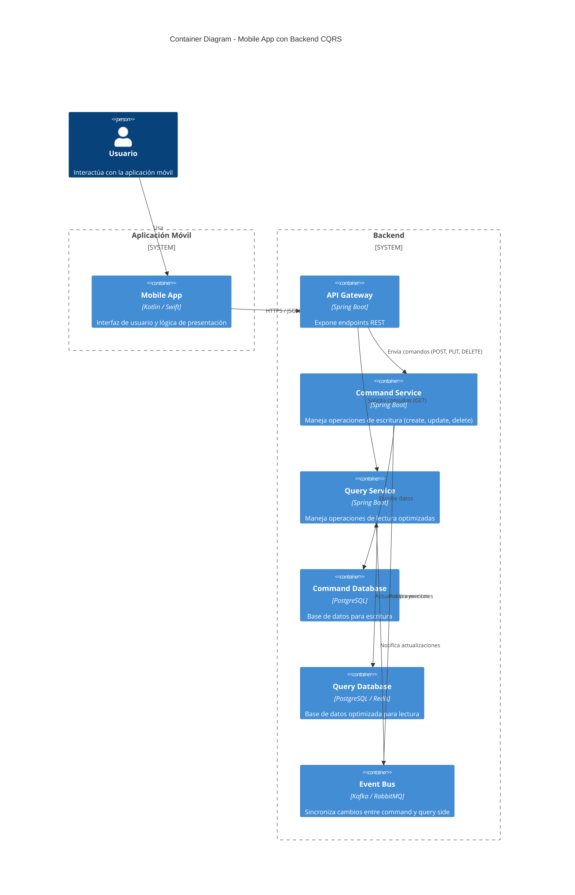

```mermaid 
C4Container
title Container Diagram - Mobile App con Backend CQRS

Person(user, "Usuario", "Interactúa con la aplicación móvil")

System_Boundary(mobile_app, "Aplicación Móvil") {
    Container(app, "Mobile App", "Kotlin / Swift", "Interfaz de usuario y lógica de presentación")
}

System_Boundary(backend, "Backend") {

    Container(api, "API Gateway", "Spring Boot", "Expone endpoints REST")

    Container(command_service, "Command Service", "Spring Boot", "Maneja operaciones de escritura (create, update, delete)")
    Container(query_service, "Query Service", "Spring Boot", "Maneja operaciones de lectura optimizadas")

    Container(command_db, "Command Database", "PostgreSQL", "Base de datos para escritura")
    Container(query_db, "Query Database", "PostgreSQL / Redis", "Base de datos optimizada para lectura")

    Container(event_bus, "Event Bus", "Kafka / RabbitMQ", "Sincroniza cambios entre command y query side")
}

Rel(user, app, "Usa")
Rel(app, api, "HTTPS / JSON")

Rel(api, command_service, "Envía comandos (POST, PUT, DELETE)")
Rel(api, query_service, "Solicita consultas (GET)")

Rel(command_service, command_db, "Escribe datos")
Rel(query_service, query_db, "Lee datos")

Rel(command_service, event_bus, "Publica eventos")
Rel(event_bus, query_service, "Notifica actualizaciones")

Rel(query_service, query_db, "Actualiza proyecciones")
```
