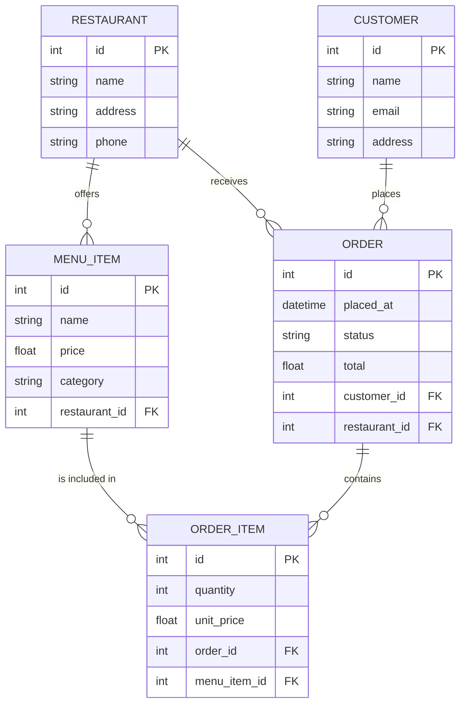

```mermaid
erDiagram
    RESTAURANT {
        int id PK
        string name
        string address
        string phone
    }

    MENU_ITEM {
        int id PK
        string name
        float price
        string category
        int restaurant_id FK
    }

    CUSTOMER {
        int id PK
        string name
        string email
        string address
    }

    ORDER {
        int id PK
        datetime placed_at
        string status
        float total
        int customer_id FK
        int restaurant_id FK
    }

    ORDER_ITEM {
        int id PK
        int quantity
        float unit_price
        int order_id FK
        int menu_item_id FK
    }

    RESTAURANT ||--o{ MENU_ITEM : "offers"
    RESTAURANT ||--o{ ORDER : "receives"
    CUSTOMER ||--o{ ORDER : "places"
    ORDER ||--o{ ORDER_ITEM : "contains"
    MENU_ITEM ||--o{ ORDER_ITEM : "is included in"
```
