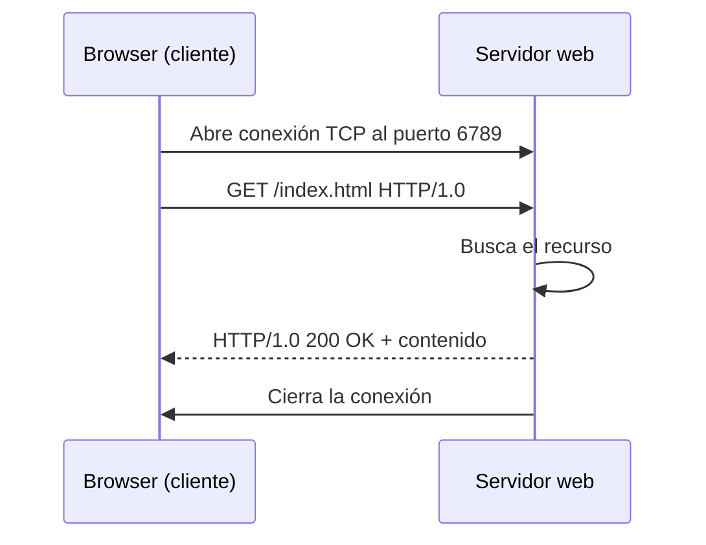

# Servidor WEB

<!-- tags: servidor web, HTTP, request, response, socket, puerto, TCP, RFC 1945, cliente-servidor, status line, header, MIME, 404 Not Found, connection refused -->

Antes de escribir una sola línea de código conviene tener claro **qué es** un servidor web y **qué hace exactamente** cuando escribes una dirección en el browser. En esta lección no hay implementación: hay modelo mental. En la siguiente lo construimos.


## Qué es un servidor web

Un **servidor web** es un programa que se queda esperando conexiones en un puerto, y cada vez que alguien le pide un recurso, se lo devuelve. Eso es todo. No es una máquina, no es un edificio con aire acondicionado: es un proceso corriendo, y puede estar corriendo en tu propio portátil.

Tres ideas que conviene separar desde el principio:

| Término | Qué es |
|---|---|
| **Servidor web** | El *programa* que atiende peticiones HTTP |
| **Servidor** (hardware) | La *máquina* donde ese programa corre |
| **Servidor de aplicaciones** | Un programa que además *ejecuta lógica* para construir la respuesta (lo vemos más adelante) |

Un servidor web en su forma más simple hace exactamente cuatro cosas, en ciclo, para siempre:

1. Escucha en un puerto.
2. Acepta una conexión de un cliente.
3. Lee la petición y averigua qué recurso están pidiendo.
4. Escribe la respuesta y cierra.

## El modelo cliente-servidor

La comunicación siempre la **inicia el cliente**. El servidor nunca llama al browser por su cuenta: se limita a esperar. Esta asimetría es la que define todo el protocolo.



El browser, cuando recibe un HTML que referencia una imagen, **vuelve a empezar el ciclo completo** para esa imagen: otra conexión, otra petición, otra respuesta. Una página con quince imágenes son dieciséis peticiones. Por eso un servidor tiene que ser capaz de atender varias a la vez — es lo que resolveremos en la segunda de las tres lecciones de implementación.

## Puertos y sockets

Una máquina tiene una sola dirección IP pero muchos programas queriendo hablar por red. El **puerto** es el número que desambigua: un entero de 16 bits que dice a cuál de todos los programas de esa máquina va dirigido el tráfico.

- Los puertos **0–1023** están reservados para servicios estándar. HTTP usa el **80**, HTTPS el **443**. Reservarlos suele requerir permisos de administrador.
- Para nuestras prácticas usaremos un puerto libre por encima de `1024` — por ejemplo `6789`. Ese mismo número tendrá que ir en la URL del browser: `http://localhost:6789/index.html`.

El **socket** es la abstracción con la que el sistema operativo te deja usar una conexión de red como si fuera un archivo: tiene un stream de entrada del que lees y un stream de salida al que escribes. En el servidor conviven dos sockets de naturaleza distinta, y confundirlos es el error más común al empezar:

| Socket | Rol |
|---|---|
| **Socket de escucha** (`ServerSocket`) | Uno solo, vive toda la ejecución. No transporta datos: solo *acepta* conexiones |
| **Socket de conexión** (`Socket`) | Uno **por cliente**, nace al aceptar y muere al terminar de responder. Por aquí sí viajan los bytes |

## Anatomía de una petición HTTP

HTTP es un protocolo de **texto plano**, y esa es la razón de que se pueda implementar a mano en una tarde. Lo que el browser manda por el socket es literalmente esto:

```http
GET /index.html HTTP/1.0
Host: localhost:6789
User-Agent: Mozilla/5.0
Accept: text/html
```

- La **primera línea** es la *request line* y trae tres campos separados por espacios: el **método** (`GET`), el **recurso** (`/index.html`) y la **versión** del protocolo.
- Las siguientes son **headers**, pares `Nombre: valor`, uno por línea.
- Una **línea en blanco** marca el final de los headers. Es la señal de "ya terminé de hablar" — sin ella el servidor se quedaría esperando indefinidamente.

## Anatomía de una respuesta HTTP

La respuesta tiene la misma forma: una primera línea especial, headers, línea en blanco, y luego el contenido.

```http
HTTP/1.0 200 OK
Content-Type: text/html
Content-Length: 34
Connection: close

<html><body>Hello World</body></html>
```

- La **status line** lleva la versión y el **código de estado**: `200 OK` si todo fue bien, `404 Not Found` si el recurso no existe, `500` si el servidor se rompió.
- `Content-Type` declara el **tipo MIME** del contenido (`text/html`, `image/jpeg`, `image/gif`). Sin él, el browser no sabe si lo que le llega es una página para renderizar o una imagen para dibujar.
- Después de la línea en blanco va el **cuerpo**: los bytes del recurso.

## CRLF: el detalle que rompe todo

La especificación exige que cada línea del mensaje termine con **carriage return + line feed**, es decir `\r\n` — no con `\n` a secas.

```java
final static String CRLF = "\r\n";
```

Es una constante de dos caracteres y es, con diferencia, la causa número uno de servidores que "no responden" en esta práctica. Si terminas las líneas con `\n`, algunos clientes toleran el mensaje y otros lo descartan sin decir nada. Que funcione en tu prueba no significa que esté bien.

## Qué versión de HTTP vamos a implementar

Implementaremos parcialmente **HTTP/1.0**, definido en el [RFC 1945](https://datatracker.ietf.org/doc/html/rfc1945). Es la versión adecuada para aprender porque su modelo es el más simple posible: **una conexión, una petición, una respuesta, se cierra**.

Las versiones modernas añaden cosas que aquí solo estorbarían: HTTP/1.1 reutiliza la conexión para varias peticiones (*keep-alive*) y HTTP/2 multiplexa varias peticiones simultáneas sobre una sola conexión binaria. Son optimizaciones sobre la misma idea, y la idea es la que vas a implementar.

## Contenido estático y contenido dinámico

Lo que vas a construir es un servidor de **contenido estático**: el recurso ya existe como archivo en disco y el servidor se limita a leerlo y enviarlo tal cual. Dos clientes que piden `/index.html` reciben exactamente los mismos bytes.

Cuando la respuesta hay que **calcularla** —consultar una base de datos, personalizar la página según quién pregunta— ya no basta con leer un archivo, y ahí aparece el **servidor de aplicaciones**. Ese es el tema de la última lección de la semana. Primero, el estático.

## Lo que sigue

Lo construimos en Java, usando solo `java.net` y `java.io`. Sin frameworks, sin librerías: sockets y strings. Y en tres etapas, cada una con el código completo y un servidor que funciona al final:

| Lección | Qué construyes | Qué le falta |
|---|---|---|
| **Un servidor de una sola petición** | El ciclo completo de HTTP, sin bucles ni hilos | Atiende una petición y se muere |
| **Servidor web multi-hilos** | Atiende para siempre y a varios clientes a la vez | Responde lo mismo a todo |
| **Sirve archivos reales** | Busca el recurso en disco, tipo MIME y 404 | Solo devuelve archivos que ya existen |

Vamos por la primera.
