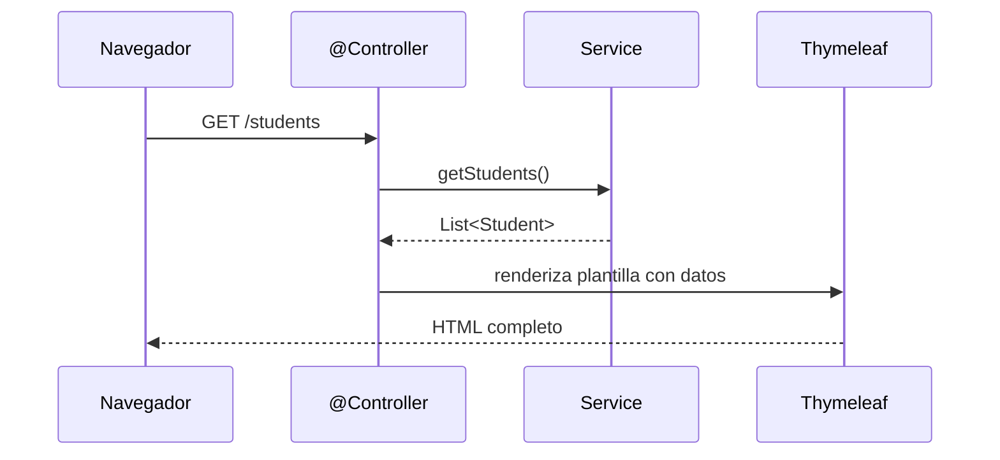
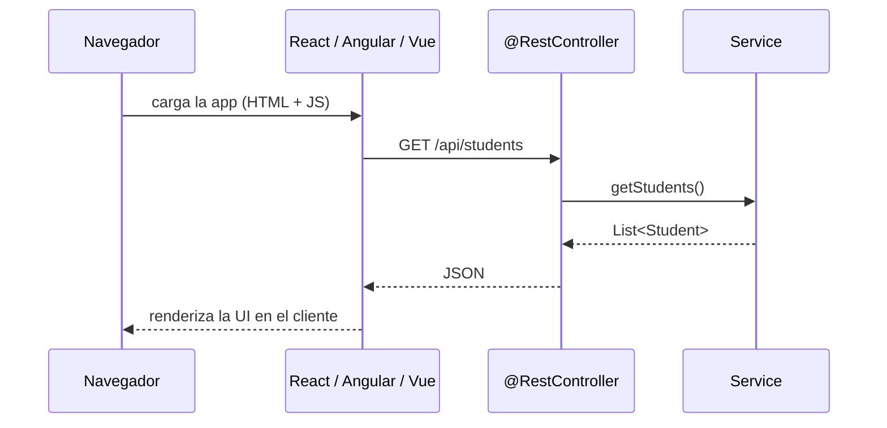

# MVC en Spring Boot

En lecciones anteriores hemos construido nuestras aplicaciones siguiendo una arquitectura de 3 capas bien definida:

`Capa de Repositorio`
Responsable del acceso a los datos. Se comunica directamente con la base de datos. (Ej: `StudentRepository`)

`Capa de Servicio`
Contiene la lógica de negocio principal. Orquesta las operaciones, llama a los repositorios y puede aplicar reglas de negocio complejas. (Ej: `StudentService`)

`Capa de Controlador`
Expone la funcionalidad de la aplicación al mundo exterior, generalmente a través de endpoints HTTP. Recibe las peticiones, las delega a la capa de servicio y devuelve una respuesta.

## ¿Cómo se relacionan MVC y la Arquitectura de 3 Capas?

Es muy común confundir estos dos patrones, pero en realidad se complementan: la arquitectura de 3 capas es una forma de implementar la parte backend del patrón MVC.

`Diferencias clave`

- La arquitectura en 3 capas organiza la aplicación según `responsabilidades técnicas`: acceso a datos, lógica de negocio y exposición al exterior.
- El patrón MVC organiza la aplicación según `responsabilidades de interacción`: Modelo, Vista y Controlador.

## Así encajan las piezas en Spring Boot

```svg
<svg id="mvcCapas" xmlns="http://www.w3.org/2000/svg" viewBox="0 0 960 824" width="100%" style="max-width:960px;display:block;margin:0 auto" role="img" aria-labelledby="mvcCapas-ttl mvcCapas-dsc" font-family="ui-sans-serif, -apple-system, 'Segoe UI', Inter, Roboto, Helvetica, Arial, sans-serif">
  <title id="mvcCapas-ttl">MVC sobre la arquitectura de 3 capas</title>
  <desc id="mvcCapas-dsc">La Vista corresponde a Thymeleaf o a un frontend como React; el Controlador a @Controller o @RestController; el Modelo agrupa el servicio, el repositorio y las entidades, que se apoyan en la base de datos.</desc>
  <defs>
    <style>
      #mvcCapas .card{stroke-width:1.5}
      #mvcCapas .hero{stroke-width:2.5;filter:url(#mvcCapas-lift)}
      #mvcCapas .n-violet{fill:#F4EBFF;stroke:#C9A6EE} #mvcCapas .t-violet{fill:#7439B8}
      #mvcCapas .n-amber{fill:#FFF3DC;stroke:#F0C572} #mvcCapas .t-amber{fill:#A96C05}
      #mvcCapas .n-teal{fill:#E3F6F3;stroke:#86D3CA} #mvcCapas .t-teal{fill:#0F8478}
      #mvcCapas .n-slate{fill:#EFF1F5;stroke:#C4CBD8} #mvcCapas .t-slate{fill:#556074}
      #mvcCapas .title{fill:#161A26;font-size:22px;font-weight:700}
      #mvcCapas .sub{fill:#79809A;font-size:13.5px}
      #mvcCapas .h{font-size:12px;font-weight:700;letter-spacing:.08em}
      #mvcCapas .role{font-size:18px;font-weight:700}
      #mvcCapas .nt{font-size:16px;font-weight:600}
      #mvcCapas .nb{fill:#454C61;font-size:13px}
      #mvcCapas .lbl{fill:#79809A;font-size:12px;font-weight:500}
      #mvcCapas .layer{fill:#454C61;font-size:13px;font-weight:600}
      #mvcCapas .mono{font-family:ui-monospace, SFMono-Regular, 'SF Mono', Menlo, Consolas, monospace}
      #mvcCapas .link{fill:none;stroke:#556074;stroke-width:1.75;marker-end:url(#mvcCapas-arrow)}
      #mvcCapas .async{stroke-dasharray:6 5}
    </style>
    <marker id="mvcCapas-arrow" viewBox="0 0 10 10" refX="9" refY="5" markerWidth="7" markerHeight="7" markerUnits="strokeWidth" orient="auto-start-reverse">
      <path d="M0,0 L10,5 L0,10 L2.4,5 Z" fill="#556074"/>
    </marker>
    <filter id="mvcCapas-lift" x="-25%" y="-25%" width="150%" height="150%">
      <feDropShadow dx="0" dy="3" stdDeviation="6" flood-color="#0B1020" flood-opacity="0.14"/>
    </filter>
  </defs>

  <rect width="960" height="824" rx="16" fill="#FBFBFD"/>

  <text class="title" x="48" y="56">MVC sobre la arquitectura de 3 capas</text>
  <text class="sub" x="48" y="80" data-fit="860">Cada rol de MVC agrupa una o varias piezas de tu proyecto Spring Boot.</text>

  <text class="h t-slate" x="48" y="112">MVC</text>
  <text class="h t-slate" x="216" y="112">TU PROYECTO SPRING BOOT</text>
  <text class="h t-slate" x="744" y="112">3 CAPAS</text>

  <g transform="translate(48,128)">
    <rect class="card n-violet" width="136" height="96" rx="12"/>
    <text class="role t-violet" x="68" y="40" text-anchor="middle" data-fit="120">Vista</text>
    <text class="nb" x="68" y="62" text-anchor="middle" data-fit="120">lo que ve</text>
    <text class="nb" x="68" y="80" text-anchor="middle" data-fit="120">el usuario</text>
  </g>
  <g transform="translate(48,272)">
    <rect class="card n-amber" width="136" height="96" rx="12"/>
    <text class="role t-amber" x="68" y="40" text-anchor="middle" data-fit="120">Controlador</text>
    <text class="nb" x="68" y="62" text-anchor="middle" data-fit="120">conecta Vista</text>
    <text class="nb" x="68" y="80" text-anchor="middle" data-fit="120">y Modelo</text>
  </g>
  <g transform="translate(48,408)">
    <rect class="card n-teal" width="136" height="240" rx="12"/>
    <text class="role t-teal" x="68" y="104" text-anchor="middle" data-fit="120">Modelo</text>
    <text class="nb" x="68" y="128" text-anchor="middle" data-fit="120">datos + lógica</text>
    <text class="nb" x="68" y="146" text-anchor="middle" data-fit="120">de negocio</text>
  </g>

  <g transform="translate(216,128)">
    <rect class="card n-violet" width="236" height="96" rx="12"/>
    <text class="nt t-violet" x="16" y="32" data-fit="204">Thymeleaf / JSP</text>
    <text class="nb" x="16" y="56" data-fit="204">HTML dentro del proyecto,</text>
    <text class="nb" x="16" y="75" data-fit="204">renderizado en el servidor</text>
  </g>
  <g transform="translate(476,128)">
    <rect class="card n-violet" width="236" height="96" rx="12" stroke-dasharray="6 5"/>
    <text class="nt t-violet" x="16" y="32" data-fit="204">React / Angular / Vue</text>
    <text class="nb" x="16" y="56" data-fit="204">app aparte, en el navegador;</text>
    <text class="nb" x="16" y="75" data-fit="204">consume la API REST</text>
  </g>

  <path class="link" d="M312,224 V264"/>
  <text class="lbl" x="304" y="248" text-anchor="end" data-fit="80">petición</text>
  <path class="link" d="M376,272 V232"/>
  <text class="lbl mono" x="384" y="248" data-fit="60">HTML</text>
  <path class="link" d="M572,224 V264"/>
  <text class="lbl" x="564" y="248" text-anchor="end" data-fit="80">petición</text>
  <path class="link" d="M636,272 V232"/>
  <text class="lbl mono" x="644" y="248" data-fit="60">JSON</text>

  <g transform="translate(216,272)">
    <rect class="card n-amber" width="236" height="96" rx="12"/>
    <text class="nt t-amber mono" x="16" y="32" data-fit="204">@Controller</text>
    <text class="nb" x="16" y="56" data-fit="204">devuelve una vista HTML</text>
    <text class="nb" x="16" y="75" data-fit="204">ya armada</text>
  </g>
  <g transform="translate(476,272)">
    <rect class="card n-amber" width="236" height="96" rx="12"/>
    <text class="nt t-amber mono" x="16" y="32" data-fit="204">@RestController</text>
    <text class="nb" x="16" y="56" data-fit="204">devuelve datos JSON / XML,</text>
    <text class="nb" x="16" y="75" data-fit="204">sin HTML</text>
  </g>

  <path class="link" d="M334,368 V440"/>
  <path class="link" d="M594,368 V440"/>
  <rect x="408" y="378" width="112" height="20" fill="#FBFBFD"/>
  <text class="lbl" x="464" y="388" text-anchor="middle" dy="0.35em" data-fit="108">ambos delegan</text>

  <rect x="216" y="408" width="496" height="240" rx="16" fill="none" stroke="#86D3CA" stroke-width="1.25" stroke-dasharray="6 5"/>
  <text class="h t-teal" x="232" y="432">MODELO</text>

  <g transform="translate(232,448)">
    <rect class="card hero n-teal" width="464" height="72" rx="12" stroke="#0F8478"/>
    <text class="nt t-teal mono" x="16" y="30" data-fit="432">StudentService</text>
    <text class="nb" x="16" y="54" data-fit="432">reglas de negocio · aquí vive la inteligencia de la app</text>
  </g>

  <path class="link" d="M342,520 V544"/>
  <text class="lbl" x="352" y="536" dy="0.1em" data-fit="80">consulta</text>
  <path class="link async" d="M586,520 V544"/>
  <text class="lbl" x="596" y="536" dy="0.1em" data-fit="60">usa</text>

  <g transform="translate(232,552)">
    <rect class="card n-teal" width="220" height="72" rx="12"/>
    <text class="nt t-teal mono" x="16" y="30" data-fit="188">StudentRepository</text>
    <text class="nb" x="16" y="54" data-fit="188">lee y guarda los datos</text>
  </g>
  <g transform="translate(476,552)">
    <rect class="card n-teal" width="220" height="72" rx="12"/>
    <text class="nt t-teal mono" x="16" y="30" data-fit="188">Student · Course</text>
    <text class="nb" x="16" y="54" data-fit="188">entidades: forma de los datos</text>
  </g>

  <path class="link" d="M342,624 V688"/>
  <text class="lbl" x="352" y="672" data-fit="100">SQL vía JPA</text>

  <g transform="translate(270,696)">
    <path class="card n-slate" d="M0,14 A72,14 0 0 1 144,14 V66 A72,14 0 0 1 0,66 Z"/>
    <path d="M0,14 A72,14 0 0 0 144,14" fill="none" stroke="#C4CBD8" stroke-width="1.5"/>
    <text class="nt t-slate" x="72" y="50" text-anchor="middle" data-fit="128">Base de datos</text>
  </g>

  <g transform="translate(476,680)">
    <rect width="436" height="96" rx="6" fill="#FFF3DC" stroke="#F0C572" stroke-width="1.25" stroke-dasharray="5 4"/>
    <text class="t-amber" x="16" y="28" font-size="14" font-weight="700" data-fit="404">Error común</text>
    <text class="nb" x="16" y="52" data-fit="404">Pensar que Modelo = entidad. En MVC el Modelo</text>
    <text class="nb" x="16" y="72" data-fit="404">es todo el bloque: entidades, repositorios y servicios.</text>
  </g>

  <g transform="translate(744,148)">
    <rect class="n-slate" width="168" height="56" rx="10" stroke-width="1.25"/>
    <text class="layer" x="12" y="24" data-fit="152">Presentación</text>
    <text class="lbl" x="12" y="42" data-fit="144">fuera de las 3 capas</text>
  </g>
  <g transform="translate(744,300)">
    <rect class="n-slate" width="168" height="40" rx="10" stroke-width="1.25"/>
    <text class="layer" x="12" y="20" dy="0.35em" data-fit="152">Capa de Controlador</text>
  </g>
  <g transform="translate(744,464)">
    <rect class="n-slate" width="168" height="40" rx="10" stroke-width="1.25"/>
    <text class="layer" x="12" y="20" dy="0.35em" data-fit="152">Capa de Servicio</text>
  </g>
  <g transform="translate(744,568)">
    <rect class="n-slate" width="168" height="40" rx="10" stroke-width="1.25"/>
    <text class="layer" x="12" y="20" dy="0.35em" data-fit="152">Capa de Repositorio</text>
  </g>
  <path d="M720,320 H736 M720,484 H736 M720,588 H736 M720,176 H736" stroke="#C4CBD8" stroke-width="1.25" stroke-dasharray="3 3"/>
</svg>
```

`Model`
En Spring, el `Modelo` no es una sola clase sino todo el conjunto que gestiona datos y lógica de negocio. Un error común es pensar que Modelo = entidad, pero en MVC el Modelo es más amplio: es toda la "inteligencia" de la aplicación.

Por eso el Modelo agrupa tres componentes:

- `Entidades` (`Student`, `Course`): definen la estructura de los datos.
- `Repositorios`: permiten acceder y persistir los datos.
- `Servicios`: aplican las reglas de negocio y transforman los datos. El `Service` es precisamente donde vive la inteligencia de la aplicación, y por eso pertenece al Modelo, no al Controlador.

`View`
La Vista depende de la tecnología de presentación que uses:

- Con `Thymeleaf` o `JSP`, la vista forma parte del mismo proyecto y se ajusta al MVC tradicional.
- Con `React`, `Angular` o `Vue`, la vista vive fuera del backend. En ese caso, Spring Boot actúa como proveedor de datos (API REST) y la vista se renderiza en el cliente.

`Controller`
El Controlador conecta la Vista con el Modelo. En Spring Boot tiene dos enfoques:

- Con `@Controller`: devuelve vistas HTML renderizadas en el servidor.
- Con `@RestController`: expone datos en formato JSON o XML para que un frontend u otra aplicación los consuma.

## Server-Side Rendering vs Client-Side Rendering

La diferencia entre usar `@Controller` y `@RestController` refleja dos modelos distintos de renderizado.

```svg
<svg id="mvcRender" xmlns="http://www.w3.org/2000/svg" viewBox="0 0 960 688" width="100%" style="max-width:960px;display:block;margin:0 auto" role="img" aria-labelledby="mvcRender-ttl mvcRender-dsc" font-family="ui-sans-serif, -apple-system, 'Segoe UI', Inter, Roboto, Helvetica, Arial, sans-serif">
  <title id="mvcRender-ttl">¿Dónde vive la Vista? SSR frente a CSR</title>
  <desc id="mvcRender-dsc">Con Server-Side Rendering la plantilla Thymeleaf está en el servidor y viaja HTML completo al navegador. Con Client-Side Rendering la vista es una app React, Angular o Vue en el navegador y el servidor solo envía JSON.</desc>
  <defs>
    <style>
      #mvcRender .card{stroke-width:1.5}
      #mvcRender .hero{stroke-width:2.5;filter:url(#mvcRender-lift)}
      #mvcRender .n-violet{fill:#F4EBFF;stroke:#C9A6EE} #mvcRender .t-violet{fill:#7439B8}
      #mvcRender .n-amber{fill:#FFF3DC;stroke:#F0C572} #mvcRender .t-amber{fill:#A96C05}
      #mvcRender .n-teal{fill:#E3F6F3;stroke:#86D3CA} #mvcRender .t-teal{fill:#0F8478}
      #mvcRender .n-slate{fill:#FFFFFF;stroke:#C4CBD8} #mvcRender .t-slate{fill:#556074}
      #mvcRender .title{fill:#161A26;font-size:22px;font-weight:700}
      #mvcRender .sub{fill:#79809A;font-size:13.5px}
      #mvcRender .h{font-size:12px;font-weight:700;letter-spacing:.08em}
      #mvcRender .nt{font-size:16px;font-weight:600}
      #mvcRender .nb{fill:#454C61;font-size:13px}
      #mvcRender .lbl{fill:#556074;font-size:12px;font-weight:600}
      #mvcRender .note{fill:#79809A;font-size:12.5px;font-style:italic}
      #mvcRender .mono{font-family:ui-monospace, SFMono-Regular, 'SF Mono', Menlo, Consolas, monospace}
      #mvcRender .link{fill:none;stroke:#556074;stroke-width:1.75;marker-end:url(#mvcRender-arrow)}
      #mvcRender .wire{stroke:#7439B8;stroke-width:2.25}
    </style>
    <marker id="mvcRender-arrow" viewBox="0 0 10 10" refX="9" refY="5" markerWidth="7" markerHeight="7" markerUnits="strokeWidth" orient="auto-start-reverse">
      <path d="M0,0 L10,5 L0,10 L2.4,5 Z" fill="#556074"/>
    </marker>
    <marker id="mvcRender-arrow-v" viewBox="0 0 10 10" refX="9" refY="5" markerWidth="6" markerHeight="6" markerUnits="strokeWidth" orient="auto-start-reverse">
      <path d="M0,0 L10,5 L0,10 L2.4,5 Z" fill="#7439B8"/>
    </marker>
    <filter id="mvcRender-lift" x="-25%" y="-25%" width="150%" height="150%">
      <feDropShadow dx="0" dy="3" stdDeviation="6" flood-color="#0B1020" flood-opacity="0.14"/>
    </filter>
  </defs>

  <rect width="960" height="688" rx="16" fill="#FBFBFD"/>

  <text class="title" x="48" y="56">¿Dónde vive la Vista?</text>
  <text class="sub" x="48" y="80" data-fit="860">El mismo Modelo sirve a los dos enfoques; lo que cambia es quién arma el HTML y qué viaja por la red.</text>

  <rect x="48" y="104" width="408" height="536" rx="16" fill="#EFF1F5"/>
  <text class="h t-slate" x="72" y="136" data-fit="360">SERVER-SIDE RENDERING (SSR)</text>

  <g transform="translate(72,160)">
    <rect class="card n-slate" width="360" height="104" rx="12"/>
    <text class="nt t-slate" x="16" y="32" data-fit="328">Navegador</text>
    <text class="nb" x="16" y="56" data-fit="328">recibe la página ya armada</text>
    <text class="nb" x="16" y="76" data-fit="328">y solo la muestra</text>
  </g>

  <rect x="60" y="384" width="384" height="184" rx="16" fill="none" stroke="#C4CBD8" stroke-width="1.25" stroke-dasharray="6 5"/>
  <text class="h t-slate" x="428" y="544" text-anchor="end" data-fit="180">SERVIDOR · SPRING BOOT</text>

  <path class="link" d="M152,264 V392"/>
  <text class="lbl mono" x="160" y="300" data-fit="100">GET /students</text>
  <path class="link wire" marker-end="url(#mvcRender-arrow-v)" d="M352,400 V272"/>
  <text class="lbl" x="344" y="328" text-anchor="end" fill="#7439B8" style="fill:#7439B8" data-fit="110">HTML completo</text>

  <g transform="translate(72,400)">
    <rect class="card n-amber" width="160" height="72" rx="12"/>
    <text class="nt t-amber mono" x="16" y="30" data-fit="128">@Controller</text>
    <text class="nb" x="16" y="52" data-fit="128">pide los datos</text>
  </g>
  <path class="link" d="M232,436 H264"/>
  <g transform="translate(272,400)">
    <rect class="card hero n-violet" width="160" height="72" rx="12" stroke="#7439B8"/>
    <text class="nt t-violet" x="16" y="30" data-fit="128">Thymeleaf</text>
    <text class="nb" x="16" y="52" data-fit="128">llena la plantilla</text>
  </g>
  <path class="link" d="M152,472 V496"/>
  <g transform="translate(72,504)">
    <rect class="card n-teal" width="160" height="48" rx="12"/>
    <text class="nt t-teal mono" x="80" y="24" dy="0.35em" text-anchor="middle" data-fit="128">Service</text>
  </g>

  <g transform="translate(72,584)">
    <rect width="360" height="36" rx="18" fill="#F4EBFF" stroke="#C9A6EE" stroke-width="1.25"/>
    <text x="180" y="18" dy="0.35em" text-anchor="middle" class="t-violet" font-size="13.5" font-weight="700" data-fit="330">La Vista vive en el servidor</text>
  </g>

  <rect x="504" y="104" width="408" height="536" rx="16" fill="#EFF1F5"/>
  <text class="h t-slate" x="528" y="136" data-fit="360">CLIENT-SIDE RENDERING (CSR)</text>

  <g transform="translate(528,160)">
    <rect class="card n-slate" width="360" height="104" rx="12"/>
    <text class="nt t-slate" x="16" y="32" data-fit="140">Navegador</text>
    <g transform="translate(144,14)">
      <rect class="card hero n-violet" width="200" height="76" rx="10" stroke="#7439B8"/>
      <text class="nt t-violet" x="14" y="28" data-fit="176">React / Angular / Vue</text>
      <text class="nb" x="14" y="50" data-fit="176">arma la UI con los datos</text>
    </g>
  </g>

  <rect x="516" y="384" width="384" height="184" rx="16" fill="none" stroke="#C4CBD8" stroke-width="1.25" stroke-dasharray="6 5"/>
  <text class="h t-slate" x="884" y="544" text-anchor="end" data-fit="180">SERVIDOR · SPRING BOOT</text>

  <path class="link" d="M632,264 V392"/>
  <text class="lbl mono" x="640" y="300" data-fit="130">GET /api/students</text>
  <path class="link wire" marker-end="url(#mvcRender-arrow-v)" d="M808,400 V272"/>
  <text class="lbl mono" x="800" y="328" text-anchor="end" style="fill:#7439B8" data-fit="60">JSON</text>

  <g transform="translate(528,400)">
    <rect class="card n-amber" width="360" height="72" rx="12"/>
    <text class="nt t-amber mono" x="16" y="30" data-fit="328">@RestController</text>
    <text class="nb" x="16" y="52" data-fit="328">devuelve solo datos, sin plantillas</text>
  </g>
  <path class="link" d="M608,472 V496"/>
  <g transform="translate(528,504)">
    <rect class="card n-teal" width="160" height="48" rx="12"/>
    <text class="nt t-teal mono" x="80" y="24" dy="0.35em" text-anchor="middle" data-fit="128">Service</text>
  </g>

  <g transform="translate(528,584)">
    <rect width="360" height="36" rx="18" fill="#F4EBFF" stroke="#C9A6EE" stroke-width="1.25"/>
    <text x="180" y="18" dy="0.35em" text-anchor="middle" class="t-violet" font-size="13.5" font-weight="700" data-fit="330">La Vista vive en el cliente</text>
  </g>

  <text class="note" x="48" y="668" style="font-style:normal" data-fit="860">En violeta, la Vista y lo que viaja hacia el navegador.</text>
</svg>
```

En el `Server-Side Rendering (SSR)`, el servidor es responsable de construir el HTML completo y enviárselo al navegador listo para mostrar. El navegador simplemente lo despliega.



En el `Client-Side Rendering (CSR)`, el servidor solo expone datos en formato JSON. El navegador descarga el frontend (React, Angular, Vue) y es este quien construye la interfaz con esos datos.


