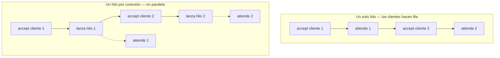

# Servidor web multi-hilos

<!-- tags: Runnable, Thread, start, run, ServerSocket, accept, bucle infinito, concurrencia, un hilo por conexión, el servidor se cuelga, atiende de a uno, Thread.sleep -->

El servidor de la lección anterior atiende una petición y se muere. Aquí lo convertimos en un servidor de verdad: uno que atiende **indefinidamente** y **a varios clientes a la vez**.


Son dos problemas distintos y conviene no mezclarlos. El primero se resuelve con un bucle. El segundo, no — y ver por qué es el objetivo real de esta lección.

**Todo el código está completo.**

## Paso 1 · El bucle infinito

Lo primero es evidente: el `accept()` no puede ejecutarse una sola vez.

```java
ServerSocket serverSocket = new ServerSocket(port);

while (true) {
    Socket connectionSocket = serverSocket.accept();
    // ... leer la petición y responder, como en la lección anterior
    connectionSocket.close();
}
```

Ya no cerramos el `serverSocket`: vive mientras viva el programa. Lo que se cierra en cada vuelta es el socket de **conexión**, el de ese cliente concreto.

Con esto el servidor atiende peticiones para siempre. Parece que ya está.

## Paso 2 · Por qué el bucle no basta

No está. Este servidor atiende **de a uno**, y la diferencia se ve en cuanto una petición tarda.

Añade temporalmente esta línea justo después del `accept()`, simulando una respuesta lenta —una consulta a base de datos, un archivo grande—:

```java
Thread.sleep(10000);   // 10 segundos
```

Ahora abre **dos pestañas** del browser al mismo tiempo. La primera tarda 10 segundos, lo esperable. Pero la segunda tarda **20**: no empieza a ser atendida hasta que la primera termina del todo.

La razón es que hay un solo hilo de ejecución. Mientras está dentro del cuerpo del `while` atendiendo a un cliente, **no está en el `accept()`**, así que nadie más puede entrar. El bucle da la vuelta cuando el cliente anterior ya se fue.



Y no es un caso rebuscado: una página con quince imágenes son dieciséis peticiones, que el browser lanza casi a la vez. Con un solo hilo se sirven en fila india.

La solución es que el hilo principal **no atienda a nadie**. Que solo acepte, delegue el trabajo a otro hilo, y vuelva de inmediato al `accept()`.

## Paso 3 · Separa en dos clases

Para ejecutar algo en un hilo aparte, Java pide un objeto que implemente `Runnable` — es decir, que tenga un método `run()`. Eso obliga a partir el programa en dos clases, y la separación resulta ser la correcta también conceptualmente:

| Clase | Responsabilidad | Cuántas instancias |
|---|---|---|
| `WebServer` | Escucha y acepta. Nunca lee ni escribe datos | Una |
| `HttpRequest` | Atiende **una** conexión: lee la petición y responde | Una por cliente |

`WebServer.java`:

```java
import java.io.*;
import java.net.*;

public final class WebServer {

    public static void main(String[] args) throws Exception {

        int port = 6789;
        ServerSocket serverSocket = new ServerSocket(port);
        System.out.println("Server listening on port " + port);

        while (true) {
            // Espera bloqueante: aquí se detiene hasta que llegue un cliente
            Socket connectionSocket = serverSocket.accept();

            // Objeto que sabe atender ESTA conexión
            HttpRequest request = new HttpRequest(connectionSocket);

            // Se la entregamos a un hilo nuevo...
            Thread thread = new Thread(request);
            thread.start();

            // ...y volvemos de inmediato al accept()
        }
    }
}
```

Las tres líneas del medio son toda la diferencia. El hilo principal ya no atiende: construye, delega y vuelve.

> **`start()`, nunca `run()`.** Llamar a `request.run()` compila igual y hace lo mismo… en el hilo principal. No crea ningún hilo, así que vuelves exactamente al servidor secuencial del Paso 2 pero con más clases. Es el error más común de esta lección y no da ningún síntoma hasta que pruebas con dos clientes.

## Paso 4 · La clase que atiende

`HttpRequest.java`:

```java
import java.io.*;
import java.net.*;
import java.nio.charset.StandardCharsets;

final class HttpRequest implements Runnable {

    final static String CRLF = "\r\n";
    Socket socket;

    public HttpRequest(Socket socket) throws Exception {
        this.socket = socket;
    }

    // Implementa el método run() de la interface Runnable
    public void run() {
        try {
            processRequest();
        } catch (Exception e) {
            System.out.println(e);
        }
    }

    private void processRequest() throws Exception {
        // el trabajo de verdad
    }
}
```

Hay una decisión de diseño aquí que no es cosmética: **el trabajo va en `processRequest()`, no en `run()`**.

El motivo es que `run()` está declarado en `Runnable` sin `throws`, así que no puede propagar excepciones — y todo lo que hace un servidor (leer un socket, abrir un archivo) las lanza. Poniendo el trabajo en un método aparte que sí las declara, `run()` queda como un envoltorio que las captura.

Y capturarlas importa más de lo que parece: una excepción que escapa de `run()` mata **ese hilo** en silencio. El servidor sigue corriendo tan campante, ese cliente se queda sin respuesta, y en la consola no aparece nada. Ese `catch` es lo único que te va a avisar.

El cuerpo de `processRequest()` es el mismo código de la lección anterior, ahora sobre `this.socket`:

```java
private void processRequest() throws Exception {

    BufferedReader in = new BufferedReader(
            new InputStreamReader(socket.getInputStream()));
    DataOutputStream out = new DataOutputStream(socket.getOutputStream());

    // Lee la petición
    String requestLine = in.readLine();
    System.out.println(Thread.currentThread().getName() + " -> " + requestLine);

    String headerLine;
    while ((headerLine = in.readLine()) != null && !headerLine.isEmpty()) {
        System.out.println(headerLine);
    }

    // Responde
    String body = "<html><body><h1>It works!</h1></body></html>";
    byte[] bodyBytes = body.getBytes(StandardCharsets.UTF_8);

    String head =
            "HTTP/1.0 200 OK" + CRLF +
            "Content-Type: text/html; charset=utf-8" + CRLF +
            "Content-Length: " + bodyBytes.length + CRLF +
            CRLF;

    out.write(head.getBytes(StandardCharsets.UTF_8));
    out.write(bodyBytes);
    out.flush();

    // Cierra los streams y el socket de ESTA conexión
    out.close();
    in.close();
    socket.close();
}
```

El único cambio real respecto a la lección anterior es el `Thread.currentThread().getName()` en el `println`, que imprime qué hilo está atendiendo. Es la forma más fácil de comprobar que esto funciona de verdad.

## El código completo

`HttpRequest.java`, con el método ya en su sitio. `WebServer.java` es el del Paso 3, sin cambios.

```java
import java.io.*;
import java.net.*;
import java.nio.charset.StandardCharsets;

final class HttpRequest implements Runnable {

    final static String CRLF = "\r\n";
    Socket socket;

    public HttpRequest(Socket socket) throws Exception {
        this.socket = socket;
    }

    // Implementa el método run() de la interface Runnable
    public void run() {
        try {
            processRequest();
        } catch (Exception e) {
            System.out.println(e);
        }
    }

    private void processRequest() throws Exception {

        BufferedReader in = new BufferedReader(
                new InputStreamReader(socket.getInputStream()));
        DataOutputStream out = new DataOutputStream(socket.getOutputStream());

        // Lee la petición
        String requestLine = in.readLine();
        System.out.println(Thread.currentThread().getName() + " -> " + requestLine);

        String headerLine;
        while ((headerLine = in.readLine()) != null && !headerLine.isEmpty()) {
            System.out.println(headerLine);
        }

        // Responde
        String body = "<html><body><h1>It works!</h1></body></html>";
        byte[] bodyBytes = body.getBytes(StandardCharsets.UTF_8);

        String head =
                "HTTP/1.0 200 OK" + CRLF +
                "Content-Type: text/html; charset=utf-8" + CRLF +
                "Content-Length: " + bodyBytes.length + CRLF +
                CRLF;

        out.write(head.getBytes(StandardCharsets.UTF_8));
        out.write(bodyBytes);
        out.flush();

        // Cierra los streams y el socket de ESTA conexión
        out.close();
        in.close();
        socket.close();
    }
}
```

## Pruébalo

Ejecuta `WebServer` y abre `http://localhost:6789/` en el browser. Recarga varias veces: ahora el servidor **no se muere**, y en la consola verás un nombre de hilo distinto cada vez:

```plain
Thread-0 -> GET / HTTP/1.1
Thread-1 -> GET /favicon.ico HTTP/1.1
Thread-2 -> GET / HTTP/1.1
```

Para comprobar el paralelismo de verdad, vuelve a poner el `sleep` — pero ahora **dentro de `processRequest()`**, que es donde vive el trabajo:

```java
Thread.sleep(10000);
```

Abre dos pestañas a la vez. Las dos deben tardar **10 segundos**, no 10 y 20. Ese es el resultado que buscabas: dos clientes atendidos en paralelo, cada uno en su hilo. Bórralo cuando lo hayas visto.

## Un detalle sobre el que volveremos

Este servidor crea **un hilo por cada conexión**, sin límite. Con treinta estudiantes recargando es perfecto; con treinta mil peticiones es un problema, porque cada hilo consume memoria y el sistema operativo se pasa el tiempo alternando entre ellos en vez de trabajando.

Los servidores reales usan un **pool**: un número fijo de hilos que se reparten las conexiones. La idea que acabas de implementar es la correcta; lo que cambia es de dónde sale el hilo. No lo necesitas todavía, pero conviene saber que este diseño tiene un techo.

## Cuando algo no funciona

| Síntoma | Causa |
|---|---|
| Atiende un cliente y el siguiente espera | Llamaste a `run()` en vez de `start()` |
| Siempre sale `Thread-0` | Lo mismo: no se está creando ningún hilo |
| `java.net.BindException: Address already in use` | Quedó una ejecución anterior. El bucle infinito hace que sea fácil olvidarla corriendo |
| El servidor deja de responder tras un rato | Falta el `socket.close()`; se acumulan conexiones abiertas |
| Un cliente no recibe nada y no hay error | Una excepción escapó de `processRequest()`. Mira que el `catch` de `run()` imprima algo |
| `NullPointerException` leyendo headers | Falta la condición `headerLine != null` |
| El programa termina solo | Se te escapó un `serverSocket.close()` dentro del bucle |

## Checklist

- [ ] El servidor no termina: atiende recarga tras recarga.
- [ ] Cada petición imprime un nombre de hilo distinto.
- [ ] Con el `sleep` puesto, dos pestañas tardan lo mismo que una.
- [ ] Cada conexión cierra su socket al terminar.

## Lo que sigue

Ya tienes la infraestructura: escucha para siempre y en paralelo. Lo que le falta es lo interesante — **sigue respondiendo "It works!" a todo**, da igual qué recurso le pidas. En la próxima lección aprende a leer qué archivo le están pidiendo, buscarlo en disco y devolverlo con el tipo correcto.
