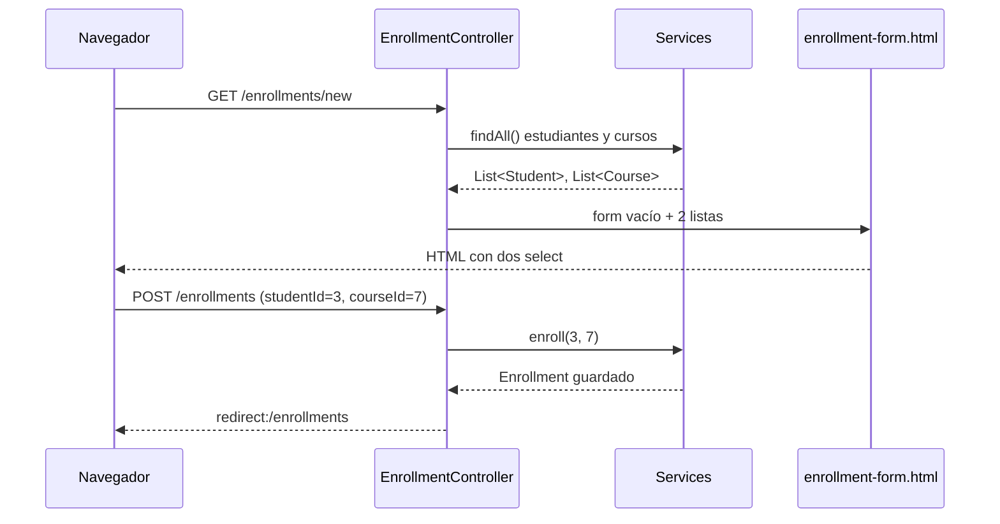

# Formulario de Matrícula con Thymeleaf

<!-- tags: select y option, th:field, formulario de matrícula, Enrollment, @ModelAttribute, objeto de formulario, th:each en option, lista vacía al recargar formulario, redirect después de POST, RedirectAttributes, StudentCourseId, Failed to convert property value -->

En la lección anterior hicimos un formulario para crear un `Course`: un objeto, unos cuantos campos de texto y un `POST`. Matricular es distinto, porque una matrícula no se escribe: **se elige**. El usuario no teclea un estudiante ni un curso; escoge uno de cada lista y el sistema crea el `Enrollment` que los une.

Eso cambia tres cosas respecto al formulario de cursos:

- El controlador tiene que mandar a la vista **dos listas**: estudiantes y cursos.
- La vista tiene que convertir cada lista en un `<select>` con sus `<option>`.
- Al hacer submit no llega un `Enrollment` armado, llegan **dos ids**. Con ellos el servicio busca las entidades y crea la matrícula.

## El recorrido completo

Son dos peticiones. El `GET` pinta el formulario con las listas; el `POST` recibe la elección, matricula y redirige.



## Punto de partida

Usamos las entidades del proyecto base: `Student`, `Course` y `Enrollment`, esta última con la clave compuesta `StudentCourseId`. También reutilizamos el servicio de matrícula de la lección de Transacciones:

```java
@Service
public class EnrollmentService {

    @Autowired
    private StudentRepository studentRepository;

    @Autowired
    private CourseRepository courseRepository;

    @Autowired
    private EnrollmentRepository enrollmentRepository;

    @Transactional
    public void enroll(Integer studentId, Integer courseId) {
        Student student = studentRepository.findById(studentId)
                .orElseThrow(() -> new RuntimeException("Estudiante no encontrado"));

        Course course = courseRepository.findById(courseId)
                .orElseThrow(() -> new RuntimeException("Curso no encontrado"));

        StudentCourseId key = new StudentCourseId(studentId, courseId);
        Enrollment enrollment = new Enrollment();
        enrollment.setId(key);
        enrollment.setStudent(student);
        enrollment.setCourse(course);

        enrollmentRepository.save(enrollment);
    }

    public boolean isEnrolled(Integer studentId, Integer courseId) {
        return enrollmentRepository.existsById(new StudentCourseId(studentId, courseId));
    }

    public List<Enrollment> findAll() {
        return enrollmentRepository.findAll();
    }
}
```

El único método nuevo es `isEnrolled`, que usaremos para no matricular dos veces a la misma persona en el mismo curso. Como la llave primaria de `Enrollment` es `StudentCourseId`, `existsById` recibe justamente eso.

## Paso 1 · Un objeto para el formulario

En el formulario de cursos enlazamos directamente la entidad `Course` con `th:object`. Con la matrícula **no conviene** hacerlo así: `Enrollment` tiene una clave compuesta y dos relaciones `@ManyToOne`, y lo que el `<select>` envía es solo un número. Si enlazamos `th:field="*{student}"`, Spring recibe el texto `"3"` y no sabe convertirlo en un `Student`. Falla con `Failed to convert property value of type 'java.lang.String' to required type 'Student'`.

La solución es un objeto pequeño que tenga exactamente lo que el formulario envía:

```java
package com.example.demo.web;

public class EnrollmentForm {

    private Integer studentId;
    private Integer courseId;

    public Integer getStudentId() { return studentId; }
    public void setStudentId(Integer studentId) { this.studentId = studentId; }

    public Integer getCourseId() { return courseId; }
    public void setCourseId(Integer courseId) { this.courseId = courseId; }
}
```

No es una entidad: no lleva `@Entity` ni se guarda en la base de datos. Solo existe para viajar entre la vista y el controlador. Convertir esos dos ids en una matrícula real es trabajo del servicio, que ya sabe hacerlo.

## Paso 2 · El controlador pasa las dos listas

El `GET` prepara tres cosas en el `Model`: el formulario vacío y las dos listas que llenarán los `<select>`.

```java
@Controller
@RequestMapping("/enrollments")
public class EnrollmentController {

    @Autowired
    private EnrollmentService enrollmentService;

    @Autowired
    private StudentService studentService;

    @Autowired
    private CourseService courseService;

    @GetMapping("/new")
    public String showEnrollmentForm(Model model) {
        model.addAttribute("enrollmentForm", new EnrollmentForm());
        loadOptions(model);
        return "enrollment-form";
    }

    private void loadOptions(Model model) {
        model.addAttribute("students", studentService.findAll());
        model.addAttribute("courses", courseService.findAll());
    }
}
```

Cargar las listas en un método aparte (`loadOptions`) no es solo por orden. En el Paso 4 vamos a necesitarlas otra vez, cuando haya que volver a mostrar el formulario con un error.

## Paso 3 · Las listas se vuelven `<select>`

En `enrollment-form.html`, `th:object` enlaza el formulario con `enrollmentForm`. Cada `<select>` se conecta a un campo con `th:field`, y sus opciones salen de recorrer la lista con `th:each`:

```html
<!DOCTYPE html>
<html xmlns:th="http://www.thymeleaf.org">
<head>
    <meta charset="UTF-8">
    <title>Matricular</title>
</head>
<body>
    <h2>Matricular estudiante</h2>

    <p th:if="${error}" th:text="${error}" style="color: crimson"></p>

    <form th:action="@{/enrollments}" th:object="${enrollmentForm}" method="post">

        <label for="studentId">Estudiante</label>
        <select id="studentId" th:field="*{studentId}" required>
            <option value="">-- Selecciona un estudiante --</option>
            <option th:each="s : ${students}"
                    th:value="${s.id}"
                    th:text="${s.name + ' (' + s.code + ')'}">
            </option>
        </select>

        <label for="courseId">Curso</label>
        <select id="courseId" th:field="*{courseId}" required>
            <option value="">-- Selecciona un curso --</option>
            <option th:each="c : ${courses}"
                    th:value="${c.id}"
                    th:text="${c.name}">
            </option>
        </select>

        <button type="submit">Matricular</button>
    </form>
</body>
</html>
```

Lo importante está en cada `<option>`, que tiene dos partes distintas:

| Atributo | Qué es | Ejemplo |
|---|---|---|
| `th:value="${s.id}"` | Lo que **se envía** al servidor | `3` |
| `th:text="${s.name ...}"` | Lo que **ve** el usuario | `Ana Gómez (A00654321)` |

El usuario elige por nombre, pero al servidor solo le llega el id. Por eso `EnrollmentForm` tiene `Integer studentId` y no un `Student`.

Otros tres detalles:

- `th:field="*{studentId}"` pone el `name="studentId"` que Spring usa para llenar el formulario. También marca como `selected` la opción que coincida con el valor actual; eso importa en el Paso 4.
- La primera opción, con `value=""`, es el *placeholder*. Junto con `required`, el navegador no deja enviar el formulario hasta que se elija algo de verdad.
- Si la lista llega vacía, el `<select>` solo tendrá el placeholder. Antes de culpar a Thymeleaf, revisa que haya estudiantes y cursos en la base de datos.

El HTML que llega al navegador ya no tiene nada de Thymeleaf:

```html
<select id="studentId" name="studentId" required>
    <option value="">-- Selecciona un estudiante --</option>
    <option value="1">Juan Pérez (A00123456)</option>
    <option value="3">Ana Gómez (A00654321)</option>
</select>
```

## Paso 4 · El submit crea la matrícula

Al pulsar *Matricular*, el navegador envía `POST /enrollments` con `studentId=3&courseId=7`. `@ModelAttribute` lo convierte en un `EnrollmentForm`, y el controlador le pasa los dos ids al servicio:

```java
@PostMapping
public String saveEnrollment(@ModelAttribute EnrollmentForm enrollmentForm,
                             Model model,
                             RedirectAttributes redirectAttributes) {

    Integer studentId = enrollmentForm.getStudentId();
    Integer courseId = enrollmentForm.getCourseId();

    if (enrollmentService.isEnrolled(studentId, courseId)) {
        model.addAttribute("error", "Ese estudiante ya está matriculado en ese curso");
        loadOptions(model);
        return "enrollment-form";
    }

    enrollmentService.enroll(studentId, courseId);
    redirectAttributes.addFlashAttribute("message", "Matrícula registrada");
    return "redirect:/enrollments";
}
```

Hay dos salidas posibles, y cada una hace algo distinto a propósito:

`Si hay error: se vuelve a mostrar la vista`
Se devuelve `"enrollment-form"`, sin redirect, para que la página conserve lo que el usuario eligió. `enrollmentForm` sigue en el `Model` y `th:field` vuelve a marcar las dos opciones como `selected`. Aquí aparece el error más típico de esta lección: **olvidar `loadOptions(model)`**. El `Model` de este `POST` es nuevo y no trae las listas del `GET`. Sin volver a cargarlas, `th:each` no tiene nada que recorrer y los dos `<select>` salen solo con el placeholder, sin ningún error que lo delate.

`Si todo sale bien: se redirige`
Se devuelve `"redirect:/enrollments"`. Si respondiéramos con una vista directamente, el navegador se quedaría en la URL del `POST`, y al recargar la página preguntaría si reenvía el formulario: **se crearía una segunda matrícula**. Con el redirect, lo último que hizo el navegador es un `GET`, y recargar no repite nada. A este patrón se le llama *Post/Redirect/Get*.

El mensaje "Matrícula registrada" no puede ir en el `Model`, porque el redirect crea una petición nueva y el `Model` se pierde. Por eso se usa `RedirectAttributes.addFlashAttribute`: Spring lo guarda solo hasta la siguiente petición y luego lo borra.

## Paso 5 · Ver que la matrícula quedó

La página a la que redirigimos lista las matrículas. Es el mismo `th:each` de siempre, esta vez navegando desde cada `Enrollment` hacia su estudiante y su curso:

```java
@GetMapping
public String listEnrollments(Model model) {
    model.addAttribute("enrollments", enrollmentService.findAll());
    return "enrollment-list";
}
```

```html
<!DOCTYPE html>
<html xmlns:th="http://www.thymeleaf.org">
<body>
    <h2>Matrículas</h2>

    <p th:if="${message}" th:text="${message}" style="color: seagreen"></p>

    <a th:href="@{/enrollments/new}">Nueva matrícula</a>

    <table>
        <tr>
            <th>Estudiante</th>
            <th>Curso</th>
        </tr>
        <tr th:each="e : ${enrollments}">
            <td th:text="${e.student.name}"></td>
            <td th:text="${e.course.name}"></td>
        </tr>
    </table>
</body>
</html>
```

`student` y `course` son relaciones `FetchType.LAZY`, pero aun así se pueden leer en la vista. Spring Boot deja abierta la sesión de Hibernate hasta que termina de renderizarse la plantilla (`spring.jpa.open-in-view`, activado por defecto; al arrancar lo avisa con un `WARN` en la consola). Si algún día lo desactivas, esta tabla lanzará `LazyInitializationException`, y habrá que traer las relaciones desde el servicio.

## Resumen

| Pieza | Responsabilidad |
|---|---|
| `EnrollmentForm` | Transportar los dos ids que envía el formulario. No es una entidad |
| `GET /enrollments/new` | Poner en el `Model` el formulario vacío y las dos listas |
| `<select th:field>` + `th:each` | Convertir cada lista en opciones: `th:value` = id, `th:text` = nombre |
| `POST /enrollments` | Validar, pedirle al servicio que matricule y redirigir |
| `EnrollmentService.enroll` | Convertir los ids en entidades y guardar el `Enrollment` |

## Ejercicio

Sobre el mismo proyecto:

- Agrega en la tabla de matrículas un botón *Eliminar* que envíe un `POST` a `/enrollments/delete` con los dos ids en campos ocultos (`<input type="hidden">`) y que después redirija a la lista.
- Haz que el `<select>` de cursos muestre también los créditos: `Bases de Datos · 3 créditos`.
- Crea una página `/students/{id}/enroll` que ya traiga el estudiante fijo y solo deje elegir el curso. Pista: el `<select>` de estudiantes desaparece y `studentId` viaja en un `<input type="hidden">`.
